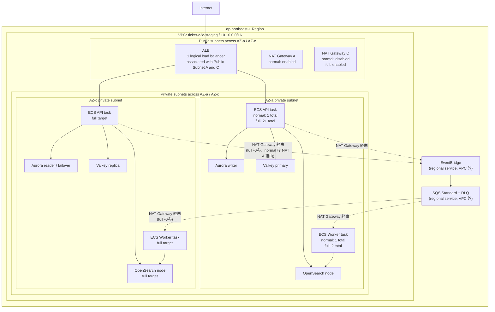

# staging 環境設計

## ステータス

ドラフト。staging 実装前に参照する正本候補。

このドキュメントは、AWS 上の staging 環境構成、設定値、GitHub Actions、smoke test、destroy 運用の方針をまとめる。Claude Code などの実装 Agent は、このドキュメントを読んで staging 構築 Issue を分割し、Terraform / CI/CD / 検証スクリプトを実装できる状態にする。

現時点で `terraform/environments/staging/` root は存在するが、初回 staging 構築前にこのドキュメントの target に合わせて設定を見直す。特に API desired count、HTTP-only endpoint、workflow 分割、smoke test、destroy 後確認は未完成の前提で扱う。

## 位置づけ

| 環境 | Terraform root / state | 目的 | コスト方針 | データ方針 |
|---|---|---|---|---|
| dev | `terraform/environments/dev` / `dev/app/terraform.tfstate` | 本番系トラックの最初の環境。構築・配線・機能検証 | 固定の小型構成。未使用時 destroy | 破棄可能 |
| staging normal | `terraform/environments/staging` / `staging/app/terraform.tfstate` + `capacity_profile=normal` | prod 移行前の本番相当トポロジー検証 | 本番と同じ壊れ方を見られる最小サイズ。検証後は毎回 destroy | seed / API 作成データで再作成可能 |
| staging full | 同じ staging state + `capacity_profile=full` | リリース前・負荷検証・failover 検証用の一時的な強化 profile | 短時間だけ冗長化・容量を上げる | seed + 検証データ |
| prod | 将来追加 | 本番サービス提供 | 常時稼働。可用性・保護優先 | 永続・保護対象 |

`staging-full` は独立したフォルダや state ではない。`staging` 環境の `capacity_profile=full` を指す呼び名に留める。フォルダ / state は環境境界、capacity profile は同じ環境内のサイズ・冗長化モード、という分け方にする。

## リージョン / VPC / AZ / subnet

- リージョンは `ap-northeast-1`。
- VPC はリージョン内に作成され、複数リージョンにはまたがらない。
- AZ はリージョン内の物理的な分離単位で、VPC と AZ は概念上どちらかが完全に内包する関係ではなく、図では直交する軸として扱う。
- Subnet は「VPC の CIDR を AZ ごとに切ったもの」。1 subnet は必ず 1 AZ に属する。
- ALB は 1 つの logical load balancer を複数 public subnet に関連付ける。AWS が各 AZ に ALB node を配置するが、利用者が `ALB A` / `ALB C` の 2 個を作るわけではない。
- NAT Gateway は logical ALB と違い、配置する subnet ごとに個別リソースができる。`normal` は 1 個、`full` は AZ ごとに 1 個。

CIDR は環境ごとに重ならないようにする。

| 環境 | VPC CIDR |
|---|---|
| dev | `10.0.0.0/16` |
| staging | `10.10.0.0/16` |
| prod candidate | `10.20.0.0/16` |

## 構成図

Mermaid / Notion では VPC と AZ の長方形を厳密にクロスさせる表現が難しいため、この図では subnet を VPC x AZ の交点として見せる。ALB は 1 つの logical resource として public subnet A / C の両方に関連付ける。



EventBridge / SQS はリージョナルサービスで VPC 外にある。private subnet の ECS タスクは NAT Gateway 経由で到達する。`worker_c --> os_c` は「AZ-c の Worker が AZ-c の OpenSearch ノードに固定される」という意味ではなく、OpenSearch domain endpoint への到達を模式的に示したもの。NAT / EventBridge / SQS への依存を減らせる VPC endpoint（Interface Endpoint）は、必要になった時点で段階的に追加を検討する。

## 初回 staging の境界

初回 staging は「ALB と、それより内部」を作る。DNS / ACM / HTTPS / フロントエンド公開までは同時にやらない。

理由:

- staging の最初の目的は、ECS、Aurora、Valkey、OpenSearch、EventBridge、SQS、Worker の配線と運用手順を検証すること。
- DNS / ACM / HTTPS は重要だが、初回構築の失敗要因を増やすため、ネットワーク・データ層の確認と分ける。
- ALB DNS name に対する HTTP smoke test で、アプリケーション経路の大半は検証できる。

フロントエンドを後で作る場合:

| フロント方式 | 配置 | staging 図での位置づけ |
|---|---|---|
| Static SPA / SSG | S3 + CloudFront | VPC 外。API は ALB を呼ぶ |
| Next.js SSR / BFF | ECS service または別 compute | VPC 内 private subnet に配置し、ALB / CloudFront から到達させる候補 |

Next.js SSR が必要な場合は、Node.js runtime がリクエスト時に API / DB / cache と通信するため、単なる静的ホスティングではなく compute として扱う。

## endpoint mode

`capacity_profile` はサイズ・冗長化を切り替える。HTTP / HTTPS / DNS は別の軸として `public_endpoint_mode` に分ける。

| mode | 初期採用 | 内容 | smoke test URL |
|---|---:|---|---|
| `alb-http-only` | Yes | ALB HTTP listener のみ。ACM 証明書なし、HTTPS listener なし、Route53 alias なし | `http://<alb_dns_name>` |
| `https-dns` | Later | `ticket-api-staging.hamilcar-hannibal.click`、ACM DNS 検証、ALB HTTPS listener、Route53 alias | `https://ticket-api-staging.hamilcar-hannibal.click` |

初回 staging は `alb-http-only` にする。現在の `terraform/environments/staging/main.tf` は ACM 証明書発行・Route53 DNS 検証・alias レコード・`enable_https = true` を無条件で作成する構成になっているため、初回構築前に `public_endpoint_mode` 変数（型・条件化方法は未定義。ACM/Route53 リソースを `count`/`for_each` で切り替える実装が必要）を追加し、`alb-http-only` を選べるようにする。

## capacity profile

`dev` は `small` 固定で、workflow から profile を選ばせない。`staging` だけ `normal` / `full` を選べる。

| 項目 | dev small | staging normal | staging full |
|---|---:|---:|---:|
| Terraform root | `dev` | `staging` | `staging` |
| `capacity_profile` 入力 | なし | `normal` | `full` |
| VPC CIDR | `10.0.0.0/16` | `10.10.0.0/16` | `10.10.0.0/16` |
| NAT Gateway | single | single | per AZ |
| API desired count | 1 | 1 | 2+ |
| Worker desired count | 1 | 1 | 2 |
| API autoscaling min/max | なし | 0 / 1 | 0 / 4 |
| Worker autoscaling min/max | なし | 0 / 4 | 0 / 8 |
| scheduled scaling | なし | 初期は空 | 初期は空 |
| Aurora writer | 1 | 1 | 1 |
| Aurora reader | 0 | 1 | 1 |
| Aurora min ACU | 0 | 0 | 0.5 |
| Aurora max ACU | 2 | 4 | 8 |
| Aurora deletion protection | false | false | false |
| Aurora skip final snapshot | true | true | true |
| Valkey | primary only | primary + replica | primary + replica |
| Valkey automatic failover | false | true | true |
| Valkey transit encryption | false | true | true |
| Valkey at-rest encryption | false | true | true |
| OpenSearch | 1 node | 1 node | 2 nodes |
| OpenSearch zone awareness | false | false | true |
| OpenSearch AZ count（`opensearch_availability_zones`） | 2 | 2 | 2 |

### 設定根拠

- staging normal は、本番相当のトポロジーを最小サイズで検証する profile。Aurora reader、Valkey replica、ALB multi-AZ association など、prod で必要になる壊れ方は残す。
- API desired count は normal では 1 にする。現状は `RUN_SCHEMA_ON_BOOT=true` のため、API を 2 タスク以上で同時起動すると DDL 競合のリスクがある。
- ECS service の `deployment_circuit_breaker` を有効化する（[production-readiness.md](./production-readiness.md) L-3、未着手）。staging は deploy 検証を主目的の一つとするため、壊れたイメージを push した際に `aws ecs wait services-stable` がタイムアウトまでハングし続けるのを防ぐ。
- Worker desired count も normal では 1 にする。初回は EventBridge -> SQS -> Worker -> OpenSearch projection の配線確認が主目的で、Worker 多重化の検証は full に回す。
- API autoscaling max は `schema-on-boot` の DDL 競合リスクがある間、normal / full とも desired count と同じ値（normal: 1、full: migration 分離後に 2+）に固定し、手動 scale out の余地を持たせない。scale out 余地は Worker autoscaling max（normal: 4、full: 8）にのみ持たせる。
- scheduled scaling actions は初期は空にする。検証タイミングと衝突して「いつの間にか 0 台」になる事故を避け、運用が安定してから夜間停止を追加する。
- Aurora normal は min ACU 0 / max ACU 4 にする。idle cost を抑えつつ、smoke test と小規模検証に十分な上限を持つ。
- Aurora full は min ACU 0.5 / max ACU 8 にする。負荷検証や failover 検証時の cold start 影響を減らす。
- staging は検証後に毎回 destroy するため、Aurora deletion protection は false、final snapshot は skip にする。永続データ保護は prod の責務にする。
- Valkey は normal から primary + replica + automatic failover + encryption を有効にする。staging の価値は「壊れ方を見られること」なので、cache を dev と同じ単一ノードにしない。
- OpenSearch は normal では 1 node にする。検索 projection の配線確認には十分で、Multi-AZ cost は full の短時間検証に寄せる。`opensearch_availability_zones`（AZ count）は zone awareness が false の dev / normal では実質的に効かない設定値であり、zone awareness を true にする full で意味を持つ。
- full の API desired count 2+ は、schema migration を boot path から分離した後に使う。分離前に full を回す場合でも、API 2+ は blocker として扱う。

## schema migration blocker

`RUN_SCHEMA_ON_BOOT=true` は staging full の前提ブロッカー。

対応方針:

- schema apply は API 起動時ではなく、明示的な migration workflow / script に分離する。
- migration が成功した後に deploy app を行う。
- API desired count 2+、rolling deploy、full profile の負荷検証は migration 分離後に実施する。

この制約が残っている間、staging normal の API desired count は 1 に固定する。

## GitHub Actions

dev と staging は workflow を分ける。dev workflow に `normal` / `full` の選択肢を出さないため。

環境ごとに入力・承認フローが分岐していくため、汎用 workflow に環境選択式の入力を持たせず、環境ごとに専用 workflow へ完全分割する。既存の汎用 `terraform-apply.yml` / `terraform-destroy.yml`（`environment` 入力で bootstrap / dev / staging を切り替える方式）は、bootstrap 用 apply/destroy workflow を切り出した上で退役させる。汎用 workflow に「dev では無視される入力」のような不要な選択肢を残さないため。

| workflow | 目的 | 入力 | Environment | 備考 |
|---|---|---|---|---|
| `terraform-plan.yml` | PR ごとの plan | なし | なし | 既存 workflow。matrix `[bootstrap, dev, staging]` で staging root の plan は既に対応済み。分割対象外 |
| `terraform-apply-bootstrap.yml` | bootstrap apply | なし | なし | 既存 `terraform-apply.yml` の bootstrap 分を切り出す |
| `terraform-apply-dev.yml` | dev apply | なし、または軽い confirm のみ | `dev` | 既存 `terraform-apply.yml` の dev 分を切り出す。`environment` 選択入力は持たない |
| `terraform-destroy-dev.yml` | dev destroy | `confirm=destroy-dev` | `dev-destroy` | destroy 後の残存リソース確認を追加する |
| `deploy-app-dev.yml` | dev deploy | `image_tag` 任意 | `dev` | 既存 `deploy-app.yml` を dev 専用名へ寄せる |
| `terraform-apply-staging.yml` | staging apply | `capacity_profile=normal|full` | `staging` | `terraform/environments/staging` を apply。`environment` 選択入力は持たず、staging 固有の `capacity_profile` のみ受け取る |
| `deploy-app-staging.yml` | staging deploy | `image_tag` 任意 | `staging` | ECR / ECS 名は `ticket-c2c-staging` を使う |
| `staging-smoke-test.yml` | staging smoke / integration test | なし | `staging-readonly` | apply ロールを流用しない。staging state file の S3 read-only に限定した専用 IAM ロールで `terraform output` を取得し、以降の HTTP 検証は AWS credential を使わない |
| `terraform-destroy-staging.yml` | staging destroy | `confirm=destroy-staging` | `staging-destroy` | 検証後に毎回手動で実行する |

`staging-ephemeral-verify.yml` は初期には作らない。apply / deploy / smoke / destroy を個別 workflow として実行し、どこで失敗したかを追いやすくする。

`capacity_profile=full` に追加の confirm 入力は置かない。staging apply は GitHub Environment protection の reviewer / branch restriction で止め、入力 UI は `normal` / `full` の選択に集中させる。

### Environment protection

GitHub Environment protection は、workflow が AWS apply / destroy role を引き受ける前の人間承認ゲート。

- `dev`
- `dev-destroy`
- `staging`
- `staging-destroy`
- `staging-readonly`（smoke test 専用。staging state file の S3 read-only ロールのみ引き受け、apply / destroy 権限は持たない）

各 Environment は required reviewer と branch restriction を設定する。`environment:` で参照する前に手動作成しておく。未作成のまま参照すると、保護なし Environment が自動作成されるため。`staging-readonly` は権限が最小のため required reviewer は必須としないが、branch restriction（`main` 固定）は他と同様に設定する。

bootstrap の IAM OIDC trust には、上記 Environment を引き受けられる `sub` を追加する。staging workflow だけ作っても、bootstrap trust が未対応なら AWS credential 取得で失敗する。

## staging の手動検証フロー

staging は毎回 destroy する。自動 destroy ではなく、検証結果を確認してから人間が `terraform-destroy-staging.yml` を実行する。

```text
terraform-apply-staging.yml
  -> deploy-app-staging.yml
  -> staging-smoke-test.yml
  -> 結果確認
  -> terraform-destroy-staging.yml
  -> destroy 後確認
```

失敗調査のために staging を残す場合は、Issue / PR / コメントに理由、期限、owner を書く。

## smoke test

`staging-smoke-test.yml` は Terraform output から `alb_dns_name` を取得し、`STAGING_BASE_URL=http://<alb_dns_name>` を設定して TypeScript の検証スクリプトを実行する。

想定:

- script: `scripts/staging/smoke-test.ts`
- npm script: `npm run smoke:staging`
- base URL: 初期は `http://<alb_dns_name>`
- test data: DB 直接投入ではなく API 経由で作る

最低限確認する API / 経路:

- `GET /healthz`
- `GET /readyz`
- `POST /events`
- `GET /events/search`
- `POST /events/:eventId/purchases`
- capacity 2 の event で purchase #1 / #2 が成功し、#3 が Valkey 前段拒否（`sold_out_precheck`）による sold-out rejection になること。Aurora への到達後に拒否された場合と区別できるよう、レスポンスまたはログで拒否レイヤを確認する
- EventBridge -> SQS -> Worker -> OpenSearch projection
- CloudWatch Logs に API / Worker の致命的エラーがないこと

Seed 方針:

- smoke test は API 経由で event を作成する。
- event capacity は 2 にする。
- event name / external id に test run id と timestamp を入れる。
- test data は smoke test 内で削除しない。失敗時に調査できるようにし、検証後の staging destroy で消す。

Timeout / retry:

| 対象 | 上限 | interval | 根拠 |
|---|---:|---:|---|
| workflow 全体 | 10 min | - | 内訳（healthz/readyz 最大 2 min + projection 確認最大 3 min = 5 min）に加え、checkout・`terraform output` 取得・event 作成・purchase 3 回・search 確認の実処理時間を見込む。staging の smoke test は配線確認であり、長時間の負荷試験ではない |
| `/healthz` / `/readyz` | 2 min | 5 sec | ECS 起動直後や ALB health check 反映の揺れを吸収する |
| projection 確認 | 3 min | 5 sec | EventBridge / SQS / Worker / OpenSearch の非同期遅延を吸収する |

負荷試験は smoke test に混ぜない。k6 のような負荷検証は、staging normal が安定し、full profile と schema migration 分離の前提が整った後に別 Issue で実施する。

## destroy 後確認

`terraform-destroy-dev.yml` と `terraform-destroy-staging.yml` の両方に、destroy 後確認を入れる。

Terraform 側:

- `terraform state list` が空であること。
- `terraform plan -destroy` が no-op であること。

AWS 側で残存確認する大きめ課金リソース:

- ALB / Target Group
- NAT Gateway
- Elastic IP
- RDS / Aurora cluster / instance
- ElastiCache / Valkey replication group
- OpenSearch domain
- ECS service / cluster
- Interface VPC Endpoint

prefix:

| 環境 | prefix |
|---|---|
| dev | `ticket-c2c-dev` |
| staging | `ticket-c2c-staging` |

CloudWatch Logs、ECR image、S3 state bucket など、明示的に残すものは summary に残す。高コスト・常時課金リソースが残っていたら destroy workflow を失敗にする。

## 実装順序

staging を一気に作る Issue は大きくなりやすいため、次の順に分割する。

1. `capacity_profile` と endpoint mode をこのドキュメントの target に合わせる。
2. dev / staging の apply / destroy / deploy workflow を分ける。
3. staging smoke test script と `staging-smoke-test.yml` を追加する。
4. `capacity_profile=normal` で apply -> deploy -> smoke -> destroy を実行し、結果を PR / 検証記録へ残す。
5. schema migration を boot path から分離する。
6. `capacity_profile=full` で failover / 負荷検証を実施する。
7. 必要になった時点で `https-dns` endpoint mode を追加し、ACM / Route53 / HTTPS を staging で検証する。

## Readiness checklist

staging normal を初回 apply する前に、少なくとも次を満たす。

- [x] GitHub Environment `staging` / `staging-destroy` に required reviewer と branch restriction を設定する。Environment は先に手動作成して保護設定を入れてから workflow で参照する。対応済み（2026-07-03、Issue #65、PR #66。reviewer: kmryst、branch restriction: `dev` / `dev-destroy` / `staging` / `staging-destroy` の全 4 環境とも custom branch policy で `main` 固定）。
- [ ] bootstrap の `apply_environments` に `staging` / `staging-destroy` を追加し、bootstrap を再 apply する。
- [ ] apply IAM ロールを `AdministratorAccess` から縮小する。dev で先に検証し、staging 追加時に trust policy と合わせて見直す。
- [x] staging 用 Terraform backend key を dev / prod と分離する。対応済み（Issue #78。`terraform/environments/staging/` を `staging/app/terraform.tfstate` で追加）。
- [x] Terraform root / state は `dev` / `staging` の環境単位にし、staging の通常構成 / 本番寄せ構成は `capacity_profile=normal|full` で切り替える。対応済み（Issue #78、Issue #80）。
- [ ] staging の VPC CIDR を `10.10.0.0/16` にする。
- [ ] staging の初回 endpoint を `alb-http-only` にする。
- [ ] staging normal の API desired count を 1、Worker desired count を 1 にする（現状 TF は API / Worker とも desired 2）。
- [ ] seed data と smoke test を自動実行できる。
- [ ] destroy workflow に `confirm=destroy-staging`、Environment protection、destroy 後確認を設定する。
- [ ] API / Worker の desired count を 2 以上にする前に、`schema-on-boot` を migration workflow / script へ移行する。
- [ ] OpenSearch のアクセスポリシーを IAM 認証（SigV4 署名）に切り替える。署名クライアント実装は dev で先行検証済み（[production-readiness.md](./production-readiness.md) M-3、PR #75）。アクセスポリシーの `Principal:"*"` からの切り替え本体は staging 構築時に実施する。
- [ ] 本番化ギャップは `production-readiness.md` に移す。

## production-readiness.md との関係

このドキュメントは staging 自体の設計正本です。

`production-readiness.md` は、dev / staging から prod に上げる前に解消すべき未対応ギャップのバックログとして扱う。staging で意図的に許容するコスト削減策が prod では許容できない場合、その差分を `production-readiness.md` に残す。

## ADR 候補

次の判断が固まった時点で ADR として記録する。

- staging を毎回 destroy する prod-like 環境として扱うか。
- staging data を seed / API 作成データで再作成する前提にするか。
- OpenSearch Multi-AZ を staging 常時構成にするか、`capacity_profile=full` の一時構成にするか。
- `public_endpoint_mode=alb-http-only` を初回 staging の正式方針にするか。
- Fargate Spot を Worker / 検証ジョブで使うか。

## 関連ドキュメント

- [dev 環境設計](./dev-environment.md)
- [dev 環境 本番化ギャップ一覧](./production-readiness.md)
- [技術スタックドラフト](./technology-stack.md)
- [技術検証計画](../poc/technical-validation-plan.md)
- [ADR 一覧](../adr/README.md)
