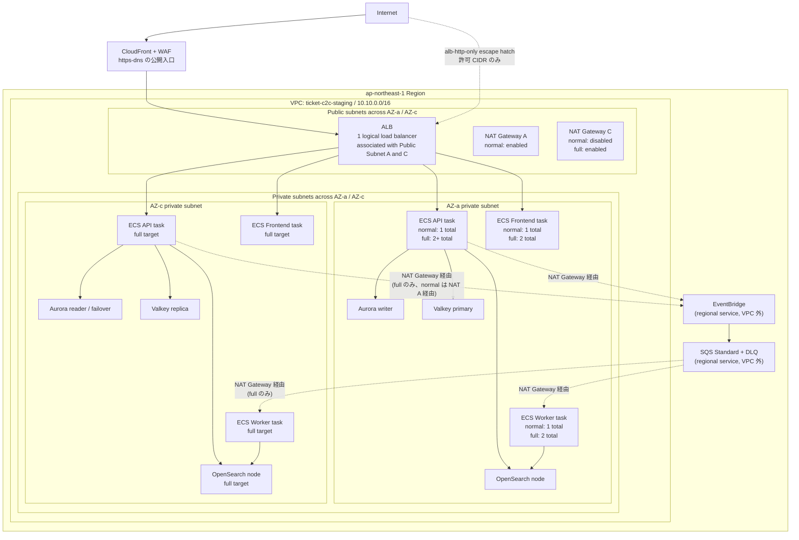

# staging 環境設計

## ステータス

設計確定・実装済み・検証済み。検証しない期間は destroy 済みを定常状態とする。

このドキュメントは、AWS 上の staging 環境構成、設定値、GitHub Actions、smoke test、destroy 運用の正本である。初回構築、負荷試験、failover、機能確認の結果は [staging 環境検証記録](./staging-environment-verification-log.md) に分離する。

`terraform/environments/staging/` root、環境別 workflow、smoke test、destroy 後確認は実装済みで、`capacity_profile=normal|full` と `public_endpoint_mode=https-dns|alb-http-only` の境界も Terraform に反映済みである。現在の既定は `capacity_profile=normal` / `public_endpoint_mode=https-dns`。

## 位置づけ

| 環境 | Terraform root / state | 目的 | コスト方針 | データ方針 |
| --- | --- | --- | --- | --- |
| dev | `terraform/environments/dev` / `dev/app/terraform.tfstate` | 本番系トラックの最初の環境。構築・配線・機能検証 | 固定の小型構成。未使用時 destroy | 破棄可能 |
| staging normal | `terraform/environments/staging` / `staging/app/terraform.tfstate` + `capacity_profile=normal` | prod 移行前の本番相当トポロジー検証 | 本番と同じ壊れ方を見られる最小サイズ。検証後は毎回 destroy | seed / API 作成データで再作成可能 |
| staging full | 同じ staging state + `capacity_profile=full` | リリース前・負荷検証・failover 検証用の一時的な強化 profile | 短時間だけ冗長化・容量を上げる | seed + 検証データ |
| prod | 将来追加 | 本番サービス提供 | 常時稼働。可用性・保護優先 | 永続・保護対象 |

`staging-full` は独立したフォルダや state ではない。`staging` 環境の `capacity_profile=full` を指す呼び名に留める。フォルダ / state は環境境界、capacity profile は同じ環境内のサイズ・冗長化モード、という分け方にする。

## リージョン / VPC / AZ / subnet

- リージョンは `ap-northeast-1`。
- VPC はリージョン内に作成され、複数リージョンにはまたがらない。
- AZ はリージョン内の物理的な分離単位で、VPC と AZ は概念上どちらかが完全に内包する関係ではなく、図では直交する軸として扱う。
- Subnet は「VPC の CIDR を AZ ごとに切ったもの」。1 subnet は必ず 1 AZ に属する。
- ALB は 1 つの logical load balancer を複数 public subnet に関連付ける。AWS が各 AZ に ALB node を配置するが、利用者が `ALB A` / `ALB C` の 2 個を作るわけではない。
- NAT Gateway は logical ALB と違い、配置する subnet ごとに個別リソースができる。`normal` は 1 個、`full` は AZ ごとに 1 個。

CIDR は環境ごとに重ならないようにする。

| 環境 | VPC CIDR |
| --- | --- |
| dev | `10.0.0.0/16` |
| staging | `10.10.0.0/16` |
| prod candidate | `10.20.0.0/16` |

## 構成図

Mermaid / Notion では VPC と AZ の長方形を厳密にクロスさせる表現が難しいため、この図では subnet を VPC x AZ の交点として見せる。ALB は 1 つの logical resource として public subnet A / C の両方に関連付ける。



CloudFront / WAF と Frontend service は `https-dns` で作成し、`alb-http-only` では作成しない。EventBridge / SQS はリージョナルサービスで VPC 外にある。private subnet の ECS タスクは NAT Gateway 経由で到達する。`worker_c --> os_c` は「AZ-c の Worker が AZ-c の OpenSearch ノードに固定される」という意味ではなく、OpenSearch domain endpoint への到達を模式的に示したもの。NAT / EventBridge / SQS への依存を減らせる VPC endpoint（Interface Endpoint）は、必要になった時点で段階的に追加を検討する。

現状は API / Worker / Frontend が同じ app Security Group を共有し、その SG から Aurora / Valkey / OpenSearch へ到達できる。サービス別の最小権限化は [Production Readiness L-24](./production-readiness.md) で追跡し、prod 化前に SG を分離する。

## endpoint mode

`capacity_profile` はサイズ・冗長化を切り替える。HTTP / HTTPS / DNS は別の軸として `public_endpoint_mode` に分ける。

| mode | 採用 | 内容 | smoke test URL |
| --- | ---: | --- | --- |
| `alb-http-only` | ローカル `terraform apply` の escape hatch として維持（初回構築で使用した名残） | ALB HTTP listener のみ。ACM 証明書なし、HTTPS listener なし、Route53 alias なし。ingress は既定で閉（Issue #232） | Terraform output の ALB URL。Frontend / CloudFront を除く API smoke test に対応 |
| `https-dns` | 現行の既定（Issue #94 / #232、Terraform 変数の既定値も統一） | `ticket-api-staging.ticket-c2c.click`、ACM DNS 検証、ALB HTTPS listener、Route53 alias（HTTP は 301 リダイレクト） | `https://ticket-app-staging.ticket-c2c.click/api`（Terraform output `api_base_url`。CloudFront 経由。ADR-0013 で ALB 直叩きは遮断） |

`terraform-apply-staging.yml` の `public_endpoint_mode` 入力で切り替える。`https-dns` を指定した場合のみ ACM 証明書・DNS 検証レコード・Route53 alias・HTTPS リスナーが作成される。smoke test 等の base URL は Terraform output `api_base_url` で取得し、smoke test は https の場合に HTTP→HTTPS の 301 リダイレクトも検証する。初回構築から現行の既定値へ至った経緯は [staging 環境検証記録](./staging-environment-verification-log.md#初回-staging-の境界) を参照する。

`https-dns` の CloudFront distribution には、L-15 の最小 security headers（HSTS / `X-Content-Type-Options` / `Referrer-Policy` / `frame-ancestors 'none'` / `X-Frame-Options: DENY`）を response headers policy で全 behavior に付与する。Next.js App Router の inline script と衝突する `script-src` 等のフル CSP は [Production Readiness L-27](./production-readiness.md) で追跡する。

ADR-0013（ALB 直叩き遮断）: `https-dns` では ALB セキュリティグループの ingress を CloudFront origin-facing managed prefix list に限定し、CloudFront 非経由の直接アクセスを遮断する。SSR の API fetch と smoke test は CloudFront 経由（`ticket-app-staging.ticket-c2c.click/api`）を叩く。`alb-http-only`（CloudFront なし・escape hatch）は Issue #232 まで従来どおり CIDR ベースの ingress を `0.0.0.0/0` で自動全開放していたが、dev 環境（`terraform/environments/dev/main.tf`）と同じく `var.alb_allowed_ingress_cidrs` を明示的に渡した場合のみ許可する方式に統一した。ingress は既定で閉になったため、`alb-http-only` へ外部からアクセスするにはローカル `terraform apply` で CIDR を明示する必要がある（次項）。

### alb-http-only をローカル apply で検証する手順（escape hatch）

Issue #232 で `alb-http-only` 時の ALB ingress `0.0.0.0/0` 全開放を廃止したため、`alb-http-only` の staging へ外部からアクセスするには `alb_allowed_ingress_cidrs` へ明示的に CIDR を渡す必要がある。CI workflow（`terraform-apply-staging.yml`）には CIDR 入力を追加しない。理由:

- `alb_allowed_ingress_cidrs` の設計意図は一時的なデバッグ用 escape hatch であり（ADR-0007 / ADR-0013）、恒常的な CI 入力に昇格させると「既定で閉」という設計を崩す。
- staging の Environment protection は 1 人運用のセルフ承認のみで、CI 経由にしても実質的な追加の安全性はない。
- 通常運用（https-dns + CloudFront prefix list 限定）の workflow を汚さない。

手順（ローカルで AWS 認証済み・`terraform init` 済みであることが前提。S3 backend は CI と共有のため、`terraform-staging` concurrency group の CI が動いていないことを確認してから実行する）。

```bash
# 1. 自分のグローバル IP を確認する
curl -s ifconfig.me

# 2. alb-http-only + 自分の IP のみ許可で apply
cd terraform/environments/staging
terraform apply \
  -var 'public_endpoint_mode=alb-http-only' \
  -var 'alb_allowed_ingress_cidrs=["<確認したIP>/32"]'

# 3. ALB DNS 名でアクセス確認
#    alb-http-only では frontend service / CloudFront を作らないため、確認できるのは API のみ。
#    ALB target group の health check と同じ /healthz（liveness、依存に触れない）を使う。
#    /api プレフィックスはアプリ側（stripApiPrefix）で除去されるため /api/healthz でも同じ応答になる。
terraform output -raw alb_dns_name
curl -i "http://$(terraform output -raw alb_dns_name)/healthz"
# 依存込みの readiness を見る場合（DB へ SELECT 1 を投げるため Aurora が auto-pause 中だと時間がかかる）
curl -i "http://$(terraform output -raw alb_dns_name)/readyz"

# 4. API を実際に叩いて検証する場合は deploy-backend-staging.yml で ECS を最新イメージに更新する
#    （terraform apply 直後はブートストラップ用 image_tag のまま）

# 5. 検証後は必ず destroy する。apply と同じ -var を渡す
#    （CI の terraform-destroy-staging.yml は変数既定値 https-dns で plan を組むため、
#     alb-http-only で作った環境は -var なしで destroy すると構成不一致になる）
terraform destroy \
  -var 'public_endpoint_mode=alb-http-only' \
  -var 'alb_allowed_ingress_cidrs=["<確認したIP>/32"]'

# 6. destroy 後確認（本ドキュメント「destroy 後確認」節と同じ）
terraform state list   # 空であること
```

## capacity profile

`capacity_profile` は staging 専用の切り替え入力。dev は `small` という入力 / profile を持たず、capacity profile の概念を使わない固定の小さい構成（Terraform 上も `dev_settings` という dev 固有の設定名で保持し、`CapacityProfile` タグを付けない。Issue #82）。`staging` だけ `normal` / `full` を選べる。

| 項目 | dev small | staging normal | staging full |
| --- | ---: | ---: | ---: |
| Terraform root | `dev` | `staging` | `staging` |
| `capacity_profile` 入力 | なし | `normal` | `full` |
| VPC CIDR | `10.0.0.0/16` | `10.10.0.0/16` | `10.10.0.0/16` |
| NAT Gateway | single | single | per AZ |
| API desired count | 1 | 1 | 2 |
| Worker desired count | 1 | 1 | 2 |
| Frontend desired count（staging は `https-dns` のみ。`alb-http-only` は 0） | 1 | 1 | 2 |
| API autoscaling min/max | なし | なし | 2 / 4 |
| API autoscaling policy | なし | なし | CPU target-tracking 60% |
| Worker autoscaling min/max | なし | なし | 2 / 4 |
| Worker autoscaling policy | なし | なし | CPU target-tracking 60% |
| Frontend autoscaling | なし | なし | なし |
| scheduled scaling | なし | 初期は空 | 初期は空 |
| Aurora writer | 1 | 1 | 1 |
| Aurora reader | 0 | 1 | 1 |
| Aurora min ACU | 0 | 0 | 0.5 |
| Aurora max ACU | 2 | 4 | 8 |
| Aurora deletion protection | false | false | false |
| Aurora skip final snapshot | true | true | true |
| Valkey | primary only | primary + replica | primary + replica |
| Valkey automatic failover | false | true | true |
| Valkey transit encryption | false | true | true |
| Valkey at-rest encryption | false | true | true |
| OpenSearch | 1 node | 1 node | 2 nodes |
| OpenSearch zone awareness | false | false | true |
| OpenSearch AZ count（`opensearch_availability_zones`） | 2 | 2 | 2 |

### 設定根拠

- staging normal は、本番相当のトポロジーを最小サイズで検証する profile。Aurora reader、Valkey replica、ALB multi-AZ association など、prod で必要になる壊れ方は残す。
- API desired count は normal では 1 にする（コスト最小の常態）。schema migration は boot path から分離済み（Issue #92）のため、複数タスク同時起動の DDL 競合リスクはない。
- ECS service の `deployment_circuit_breaker` は rollback 付きで有効化済み（[production-readiness.md](./production-readiness.md) L-3、Issue #88）。staging は deploy 検証を主目的の一つとするため、壊れたイメージを push した際の起動ループを自動 rollback する。
- Worker desired count も normal では 1 にする。初回は EventBridge -> SQS -> Worker -> OpenSearch projection の配線確認が主目的で、Worker 多重化の検証は full に回す。
- autoscaling（min/max・target-tracking policy）は full にのみ実装する（Issue #234 / ADR-0018）。normal は「安価な日常検証」、full は「負荷試験・failover 検証」という役割分担であり、policy は実際に負荷をかけて検証できる場所でしか価値がない。以前の normal（API 0/3、Worker 0/4）は `aws_appautoscaling_target`（min/max）だけを持ち target-tracking policy を実装していなかったため、実際にはスケールしない「見せかけの設定」だった。動かない設定は置かない方針で撤去した。
- full の API / Worker autoscaling min/max は 2 / 4（対称）にし、CPU 使用率 60% の target-tracking policy を有効化する（`terraform/modules/ecs-service` の `aws_appautoscaling_policy`）。実測データ（過去の負荷試験結果、キューのバックログ推移など）がない段階のため、Worker だけ非対称に大きな倍率にする根拠を持てない。まず素直な 2 倍（現状 desired_count の 2 倍）から始め、full での負荷試験結果を見て必要なら Worker の max だけ引き上げる。
- CPU 60% という閾値自体は、ECS target-tracking の一般的な出発点である 50〜70% の範囲から選んだ。高すぎるとバースト吸収の余地がなくなり、低すぎると過剰スケールアウトでコストが増える。ECS Fargate はタスク起動に環境変数取得・DB コネクションプール初期化等で 1〜2 分程度かかりうるため、60% にすることで残り 40% の余白でその間の負荷増を吸収できる。staging-full は「本番相当構成での負荷試験により autoscaling の実動作を検証する」ための profile であり、閾値は検証しやすさではなく実運用を想定した一般的な値を採用する。
- Frontend desired count は normal 1 / full 2 にする（従来は全 profile で 1 固定）。Frontend（SSR）は負荷検証の対象外という既存方針は維持し autoscaling は入れないが、full は failover 検証用 profile であるため、Frontend が 1 task 固定のままだと AZ 跨ぎの failover 検証ができず profile の目的と矛盾する。Frontend は「スケールする層」ではなく「落ちない層」という位置づけで desired_count のみ引き上げる。
- scheduled scaling actions は初期は空にする。検証タイミングと衝突して「いつの間にか 0 台」になる事故を避け、運用が安定してから夜間停止を追加する。
- Aurora normal は min ACU 0 / max ACU 4 にする。idle cost を抑えつつ、smoke test と小規模検証に十分な上限を持つ。
- Aurora full は min ACU 0.5 / max ACU 8 にする。負荷検証や failover 検証時の cold start 影響を減らす。
- staging は検証後に毎回 destroy するため、Aurora deletion protection は false、final snapshot は skip にする。永続データ保護は prod の責務にする。
- Valkey は normal から primary + replica + automatic failover + encryption を有効にする。staging の価値は「壊れ方を見られること」なので、cache を dev と同じ単一ノードにしない。
- OpenSearch は normal では 1 node にする。検索 projection の配線確認には十分で、Multi-AZ cost は full の短時間検証に寄せる。`opensearch_availability_zones`（AZ count）は zone awareness が false の dev / normal では実質的に効かない設定値であり、zone awareness を true にする full で意味を持つ。
- full の API desired count 2+ は、schema migration を boot path から分離した後に使う。分離前に full を回す場合でも、API 2+ は blocker として扱う。

## schema migration

解消済み（Issue #92）。`RUN_SCHEMA_ON_BOOT` による起動時 DDL は廃止し、TypeORM versioned migrations に移行した。

- migration 本体: `src/database/migrations/`（baseline は 2026-07-04 時点の `database/schema.sql` スナップショット）。適用履歴は DB の `typeorm_migrations` table で管理する。
- 実行経路は 2 つ。いずれも ECS run-task（API タスク定義 + command override）で private subnet 内から適用する:
  - `db-migrate-dev.yml` / `db-migrate-staging.yml`: deploy とは独立した単発実行（初回構築後や検証時）。
  - `deploy-backend-*.yml` の `run_migrations` 入力: 新イメージのタスク定義 register 後・サービス更新前に migration を実行し、成功した場合のみデプロイへ進む（スキーマ変更を含むリリース用。migration 適用〜サービス更新完了までの間、旧タスクが新スキーマ上で動くため、migration は後方互換（expand-contract）で書く）。
- migration runner は PostgreSQL advisory lock で直列化されており、誤って多重起動しても DDL は競合しない。
- スキーマ変更では `npm run migration:create -- src/database/migrations/<PascalCase名>` で migration を追加し、`src/database/data-source.ts` の `migrations` 配列とローカル PoC の正本 `database/schema.sql` を同じ PR で同期更新する。baseline migration は編集しない。

## GitHub Actions

dev と staging は workflow を分ける。dev workflow に `normal` / `full` の選択肢を出さないため。

環境ごとに入力・承認フローが分岐していくため、汎用 workflow に環境選択式の入力を持たせず、環境ごとに専用 workflow へ完全分割する。既存の汎用 `terraform-apply.yml` / `terraform-destroy.yml`（`environment` 入力で環境を切り替える方式）と `deploy-app.yml` は、bootstrap 用 apply workflow を切り出した上で退役させる。汎用 workflow に「dev では無視される入力」のような不要な選択肢を残さないため。対応済み（Issue #89。下表の workflow へ分割し、汎用 3 workflow は削除済み）。

| workflow | 目的 | 入力 | Environment | 備考 |
| --- | --- | --- | --- | --- |
| `terraform-plan.yml` | PR ごとの plan | なし | なし | 既存 workflow。matrix `[bootstrap, dev, staging]` で staging root の plan は既に対応済み。分割対象外 |
| `terraform-apply-bootstrap.yml` | bootstrap apply | なし | なし | 既存 `terraform-apply.yml` の bootstrap 分を切り出す |
| `terraform-apply-dev.yml` | dev apply | なし、または軽い confirm のみ | `dev` | 既存 `terraform-apply.yml` の dev 分を切り出す。`environment` 選択入力は持たない |
| `terraform-destroy-dev.yml` | dev destroy | `confirm=destroy-dev` | `dev-destroy` | destroy 後の残存リソース確認を追加する |
| `deploy-backend-dev.yml` | dev backend deploy | `image_tag` 任意、`run_migrations` | `dev` | L-11（Issue #182）で `deploy-app-dev.yml` から分離。本体は reusable workflow `deploy-service.yml`（Issue #180） |
| `deploy-frontend-dev.yml` | dev frontend deploy | `image_tag` 任意 | `dev` | 同上（frontend 側） |
| `terraform-apply-staging.yml` | staging apply | `capacity_profile=normal \| full`、`public_endpoint_mode=https-dns \| alb-http-only` | `staging` | `terraform/environments/staging` を apply。`environment` 選択入力は持たず、staging 固有の `capacity_profile` のみ受け取る |
| `deploy-backend-staging.yml` | staging backend deploy | `image_tag` 任意、`run_migrations` | `staging` | ECR / ECS 名は `ticket-c2c-staging` を使う |
| `deploy-frontend-staging.yml` | staging frontend deploy | `image_tag` 任意 | `staging` | alb-http-only モード（frontend service 不在）ではサービス更新をスキップ |
| `db-migrate-staging.yml` | staging DB migration（deploy 非依存の単発実行） | なし | `staging` | ECS run-task で TypeORM migrations を適用（Issue #92）。dev 用は `db-migrate-dev.yml` |
| `staging-smoke-test.yml` | staging smoke / integration test | なし | `staging-readonly` | apply ロールを流用しない。staging state file の S3 read-only に限定した専用 IAM ロールで `terraform output` を取得し、以降の HTTP 検証は AWS credential を使わない |
| `terraform-destroy-staging.yml` | staging destroy | `confirm=destroy-staging` | `staging-destroy` | 検証後に毎回手動で実行する |

`staging-ephemeral-verify.yml` は初期には作らない。apply / deploy / smoke / destroy を個別 workflow として実行し、どこで失敗したかを追いやすくする。

`capacity_profile=full` に追加の confirm 入力は置かない。staging apply は GitHub Environment protection の reviewer / branch restriction で止め、入力 UI は `normal` / `full` の選択に集中させる。

### Environment protection

GitHub Environment は、workflow が環境別 IAM role を引き受ける境界として使う。2026-07-19 に GitHub 上の設定を確認した現行値は次のとおり。

| Environment | 用途 | `main` branch restriction | required reviewer |
| --- | --- | ---: | ---: |
| `bootstrap` | bootstrap apply | あり | あり |
| `dev` | dev apply / deploy | あり | なし |
| `dev-destroy` | dev destroy | あり | あり |
| `dev-readonly` | dev smoke test | あり | なし |
| `staging` | staging apply / deploy | あり | あり |
| `staging-destroy` | staging destroy | あり | あり |
| `staging-readonly` | staging smoke test | あり | なし |

read-only Environment は state file の S3 読み取り専用ロールだけを引き受け、apply / destroy 権限を持たないため required reviewer を必須にしない。`environment:` で参照する前に Environment を手動作成する。未作成のまま参照すると保護なし Environment が自動作成されるため、branch restriction と必要な reviewer の設定を先に完了させる。

bootstrap の IAM OIDC trust には、上記 Environment を引き受けられる `sub` を追加する。staging workflow だけ作っても、bootstrap trust が未対応なら AWS credential 取得で失敗する。

## staging の手動検証フロー

staging は毎回 destroy する。自動 destroy ではなく、検証結果を確認してから人間が `terraform-destroy-staging.yml` を実行する。

```text
terraform-apply-staging.yml
  -> deploy-backend-staging.yml（初回・スキーマ変更時は run_migrations=true）
  -> deploy-frontend-staging.yml（https-dns のみ）
  -> staging-smoke-test.yml
  -> 結果確認
  -> terraform-destroy-staging.yml
  -> destroy 後確認
```

失敗調査のために staging を残す場合は、Issue / PR / コメントに理由、期限、owner を書く。

## smoke test

`staging-smoke-test.yml` は Terraform output `api_base_url` を取得し、`SMOKE_TEST_BASE_URL` に設定して TypeScript の検証スクリプトを実行する。`STAGING_BASE_URL` はローカル実行の後方互換名として script 側だけで受け付ける。

実装（Issue #90 / #94）:

- script: `scripts/staging/smoke-test.ts`
- npm script: `npm run smoke:staging`
- base URL: Terraform output `api_base_url`（`https-dns` では CloudFront 経由の `https://ticket-app-staging.ticket-c2c.click/api`、`alb-http-only` では `http://<alb_dns_name>`）。ADR-0013 で ALB 直叩きを遮断したため、https-dns では外部からの API アクセスは CloudFront の `/api/*` 経路に限られる。
- base URL が https の場合、HTTP 側が 301 で HTTPS へリダイレクトされることも検証する
- test data: DB 直接投入ではなく API 経由で作る

最低限確認する API / 経路:

- `GET /healthz`
- `GET /readyz`
- `POST /events`
- `GET /events/search`
- `POST /events/:eventId/purchases`
- capacity 2 の event で purchase #1 / #2 が成功し、#3 が Valkey 前段拒否（`sold_out_precheck`）による sold-out rejection になること。Aurora への到達後に拒否された場合と区別できるよう、レスポンスまたはログで拒否レイヤを確認する
- EventBridge -> SQS -> Worker -> OpenSearch projection
- CloudWatch Logs に API / Worker の致命的エラーがないこと

Seed 方針:

- smoke test は API 経由で event を作成する。
- event capacity は 2 にする。
- event name / external id に test run id と timestamp を入れる。
- test data は smoke test 内で削除しない。失敗時に調査できるようにし、検証後の staging destroy で消す。

Timeout / retry:

| 対象 | 上限 | interval | 根拠 |
| --- | ---: | ---: | --- |
| workflow 全体 | 10 min | - | 内訳（healthz/readyz 最大 2 min + projection 確認最大 3 min = 5 min）に加え、checkout・`terraform output` 取得・event 作成・purchase 3 回・search 確認の実処理時間を見込む。staging の smoke test は配線確認であり、長時間の負荷試験ではない |
| `/healthz` / `/readyz` | 2 min | 5 sec | ECS 起動直後や ALB health check 反映の揺れを吸収する |
| projection 確認 | 3 min | 5 sec | EventBridge / SQS / Worker / OpenSearch の非同期遅延を吸収する |

負荷試験は smoke test に混ぜない。k6 のような負荷検証は、staging normal が安定し、full profile と schema migration 分離の前提が整った後に別 Issue で実施する。

## destroy 後確認

`terraform-destroy-dev.yml` と `terraform-destroy-staging.yml` の両方に、destroy 後確認を入れる。

Terraform 側:

- `terraform state list` が空であること。
- `terraform plan -destroy` が no-op であること。

AWS 側で残存確認する大きめ課金リソース:

- ALB / Target Group
- NAT Gateway
- Elastic IP
- RDS / Aurora cluster / instance
- ElastiCache / Valkey replication group
- OpenSearch domain
- ECS service / cluster
- Interface VPC Endpoint

prefix:

| 環境 | prefix |
| --- | --- |
| dev | `ticket-c2c-dev` |
| staging | `ticket-c2c-staging` |

CloudWatch Logs、ECR image、S3 state bucket など、明示的に残すものは summary に残す。高コスト・常時課金リソースが残っていたら destroy workflow を失敗にする。

## 検証記録

初回構築の実装順序、Readiness checklist、full profile の負荷・failover 試験、フロントエンド、L-9、L-13 / L-14 の実地確認結果は [staging 環境検証記録](./staging-environment-verification-log.md) を参照する。

## production-readiness.md との関係

このドキュメントは staging 自体の設計正本です。

`production-readiness.md` は、dev / staging から prod に上げる前に解消すべき未対応ギャップのバックログとして扱う。staging で意図的に許容するコスト削減策が prod では許容できない場合、その差分を `production-readiness.md` に残す。

## ADR との関係

次の判断は [ADR-0008](../adr/0008-staging-ephemeral-prod-like-environment.md) で確定し、現在も継続している。

- staging を毎回 destroy する prod-like 環境として扱う。
- staging data は seed / API 作成データで再作成する前提にする。
- OpenSearch Multi-AZ は `capacity_profile=full` の一時構成にする。

ADR-0008 で採用した初回 endpoint の `alb-http-only` は歴史的判断であり、現行の既定は `https-dns` である。変更経緯は [staging 環境検証記録](./staging-environment-verification-log.md#初回-staging-の境界) を参照する。

## 関連ドキュメント

- [dev 環境設計](./dev-environment.md)
- [staging 環境検証記録](./staging-environment-verification-log.md)
- [Production Readiness バックログ](./production-readiness.md)
- [技術スタック](./technology-stack.md)
- [技術検証計画](../poc/technical-validation-plan.md)
- [ADR 一覧](../adr/README.md)
