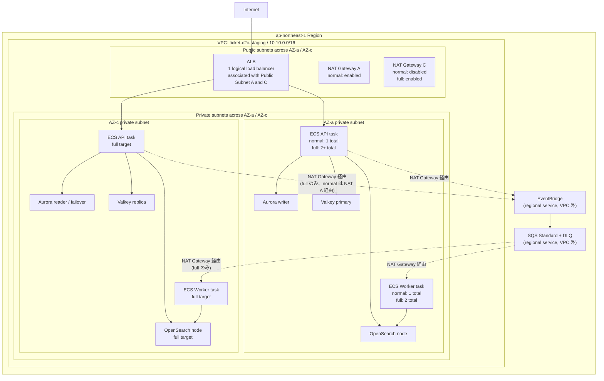

# staging 環境設計

## ステータス

ドラフト。staging 実装前に参照する正本候補。

このドキュメントは、AWS 上の staging 環境構成、設定値、GitHub Actions、smoke test、destroy 運用の方針をまとめる。Claude Code などの実装 Agent は、このドキュメントを読んで staging 構築 Issue を分割し、Terraform / CI/CD / 検証スクリプトを実装できる状態にする。

現時点で `terraform/environments/staging/` root は存在するが、初回 staging 構築前にこのドキュメントの target に合わせて設定を見直す。特に API desired count、HTTP-only endpoint、workflow 分割、smoke test、destroy 後確認は未完成の前提で扱う。

## 位置づけ

| 環境 | Terraform root / state | 目的 | コスト方針 | データ方針 |
|---|---|---|---|---|
| dev | `terraform/environments/dev` / `dev/app/terraform.tfstate` | 本番系トラックの最初の環境。構築・配線・機能検証 | 固定の小型構成。未使用時 destroy | 破棄可能 |
| staging normal | `terraform/environments/staging` / `staging/app/terraform.tfstate` + `capacity_profile=normal` | prod 移行前の本番相当トポロジー検証 | 本番と同じ壊れ方を見られる最小サイズ。検証後は毎回 destroy | seed / API 作成データで再作成可能 |
| staging full | 同じ staging state + `capacity_profile=full` | リリース前・負荷検証・failover 検証用の一時的な強化 profile | 短時間だけ冗長化・容量を上げる | seed + 検証データ |
| prod | 将来追加 | 本番サービス提供 | 常時稼働。可用性・保護優先 | 永続・保護対象 |

`staging-full` は独立したフォルダや state ではない。`staging` 環境の `capacity_profile=full` を指す呼び名に留める。フォルダ / state は環境境界、capacity profile は同じ環境内のサイズ・冗長化モード、という分け方にする。

## リージョン / VPC / AZ / subnet

- リージョンは `ap-northeast-1`。
- VPC はリージョン内に作成され、複数リージョンにはまたがらない。
- AZ はリージョン内の物理的な分離単位で、VPC と AZ は概念上どちらかが完全に内包する関係ではなく、図では直交する軸として扱う。
- Subnet は「VPC の CIDR を AZ ごとに切ったもの」。1 subnet は必ず 1 AZ に属する。
- ALB は 1 つの logical load balancer を複数 public subnet に関連付ける。AWS が各 AZ に ALB node を配置するが、利用者が `ALB A` / `ALB C` の 2 個を作るわけではない。
- NAT Gateway は logical ALB と違い、配置する subnet ごとに個別リソースができる。`normal` は 1 個、`full` は AZ ごとに 1 個。

CIDR は環境ごとに重ならないようにする。

| 環境 | VPC CIDR |
|---|---|
| dev | `10.0.0.0/16` |
| staging | `10.10.0.0/16` |
| prod candidate | `10.20.0.0/16` |

## 構成図

Mermaid / Notion では VPC と AZ の長方形を厳密にクロスさせる表現が難しいため、この図では subnet を VPC x AZ の交点として見せる。ALB は 1 つの logical resource として public subnet A / C の両方に関連付ける。



EventBridge / SQS はリージョナルサービスで VPC 外にある。private subnet の ECS タスクは NAT Gateway 経由で到達する。`worker_c --> os_c` は「AZ-c の Worker が AZ-c の OpenSearch ノードに固定される」という意味ではなく、OpenSearch domain endpoint への到達を模式的に示したもの。NAT / EventBridge / SQS への依存を減らせる VPC endpoint（Interface Endpoint）は、必要になった時点で段階的に追加を検討する。

## 初回 staging の境界

初回 staging は「ALB と、それより内部」を作る。DNS / ACM / HTTPS / フロントエンド公開までは同時にやらない。

理由:

- staging の最初の目的は、ECS、Aurora、Valkey、OpenSearch、EventBridge、SQS、Worker の配線と運用手順を検証すること。
- DNS / ACM / HTTPS は重要だが、初回構築の失敗要因を増やすため、ネットワーク・データ層の確認と分ける。
- ALB DNS name に対する HTTP smoke test で、アプリケーション経路の大半は検証できる。

フロントエンド方式は [ADR-0011](../adr/0011-nextjs-ssr-on-ecs-with-cloudfront-unified-origin.md) で確定した:

| フロント方式 | 配置 | 判断 |
|---|---|---|
| Static SPA / SSG | S3 + CloudFront | 不採用（コンテナ運用の学習・実践価値と OGP 用サーバーレンダリングを優先） |
| **Next.js SSR（採用）** | ECS Fargate（private subnet）+ CloudFront 統合オリジン | `ticket-app-<env>.ticket-c2c.click` → CloudFront →（`/api/*` は API target group、その他は frontend target group）→ 既存 ALB。ALB の default action は API のまま維持し、`ticket-api-<env>` 直アクセスは無変更 |

Next.js SSR は Node.js runtime がリクエスト時に API と通信するため、静的ホスティングではなく compute（ecs-service モジュールの `ticket-c2c-<env>-frontend` サービス）として扱う。

## endpoint mode

`capacity_profile` はサイズ・冗長化を切り替える。HTTP / HTTPS / DNS は別の軸として `public_endpoint_mode` に分ける。

| mode | 採用 | 内容 | smoke test URL |
|---|---:|---|---|
| `alb-http-only` | ローカル `terraform apply` の escape hatch として維持（初回構築で使用した名残） | ALB HTTP listener のみ。ACM 証明書なし、HTTPS listener なし、Route53 alias なし。ingress は既定で閉（Issue #232） | 非対応（`staging-smoke-test.yml` は https-dns 専用。手順は後述） |
| `https-dns` | 現行の既定（Issue #94 / #232、Terraform 変数の既定値も統一） | `ticket-api-staging.ticket-c2c.click`、ACM DNS 検証、ALB HTTPS listener、Route53 alias（HTTP は 301 リダイレクト） | `https://ticket-app-staging.ticket-c2c.click/api`（Terraform output `api_base_url`。CloudFront 経由。ADR-0013 で ALB 直叩きは遮断） |

初回 staging は `alb-http-only` で構築・検証した（[ADR-0008](../adr/0008-staging-ephemeral-prod-like-environment.md)、Issue #91）。実装順序 step 7 として `https-dns` を有効化し（Issue #94）、`terraform-apply-staging.yml` の `public_endpoint_mode` 入力（既定 `https-dns`）で切り替える。Terraform 変数の既定値は当初 ADR-0008 のとおり `alb-http-only` のままだったが、`terraform-destroy-staging.yml` が変数既定値で destroy plan を組むため通常運用（https-dns で apply）と食い違う問題があり、Issue #232 で Terraform 変数の既定値も `https-dns` に統一した。`https-dns` を指定した場合のみ ACM 証明書・DNS 検証レコード・Route53 alias・HTTPS リスナーが作成される。smoke test 等の base URL は Terraform output `api_base_url` で取得し、smoke test は https の場合に HTTP→HTTPS の 301 リダイレクトも検証する。

`https-dns` の CloudFront distribution には、L-15 の最小 security headers（HSTS / `X-Content-Type-Options` / `Referrer-Policy` / `frame-ancestors 'none'` / `X-Frame-Options: DENY`）を response headers policy で全 behavior に付与する。Next.js App Router の inline script と衝突する `script-src` 等のフル CSP は prod 化時の別課題として扱う。

ADR-0013（ALB 直叩き遮断）: `https-dns` では ALB セキュリティグループの ingress を CloudFront origin-facing managed prefix list に限定し、CloudFront 非経由の直接アクセスを遮断する。SSR の API fetch と smoke test は CloudFront 経由（`ticket-app-staging.ticket-c2c.click/api`）を叩く。`alb-http-only`（CloudFront なし・escape hatch）は Issue #232 まで従来どおり CIDR ベースの ingress を `0.0.0.0/0` で自動全開放していたが、dev 環境（`terraform/environments/dev/main.tf`）と同じく `var.alb_allowed_ingress_cidrs` を明示的に渡した場合のみ許可する方式に統一した。ingress は既定で閉になったため、`alb-http-only` へ外部からアクセスするにはローカル `terraform apply` で CIDR を明示する必要がある（次項）。

### alb-http-only をローカル apply で検証する手順（escape hatch）

Issue #232 で `alb-http-only` 時の ALB ingress `0.0.0.0/0` 全開放を廃止したため、`alb-http-only` の staging へ外部からアクセスするには `alb_allowed_ingress_cidrs` へ明示的に CIDR を渡す必要がある。CI workflow（`terraform-apply-staging.yml`）には CIDR 入力を追加しない。理由:

- `alb_allowed_ingress_cidrs` の設計意図は一時的なデバッグ用 escape hatch であり（ADR-0007 / ADR-0013）、恒常的な CI 入力に昇格させると「既定で閉」という設計を崩す。
- staging の Environment protection は 1 人運用のセルフ承認のみで、CI 経由にしても実質的な追加の安全性はない。
- 通常運用（https-dns + CloudFront prefix list 限定）の workflow を汚さない。

手順（ローカルで AWS 認証済み・`terraform init` 済みであることが前提。S3 backend は CI と共有のため、`terraform-staging` concurrency group の CI が動いていないことを確認してから実行する）。

```bash
# 1. 自分のグローバル IP を確認する
curl -s ifconfig.me

# 2. alb-http-only + 自分の IP のみ許可で apply
cd terraform/environments/staging
terraform apply \
  -var 'public_endpoint_mode=alb-http-only' \
  -var 'alb_allowed_ingress_cidrs=["<確認したIP>/32"]'

# 3. ALB DNS 名でアクセス確認
#    alb-http-only では frontend service / CloudFront を作らないため、確認できるのは API のみ。
#    ALB target group の health check と同じ /healthz（liveness、依存に触れない）を使う。
#    /api プレフィックスはアプリ側（stripApiPrefix）で除去されるため /api/healthz でも同じ応答になる。
terraform output -raw alb_dns_name
curl -i "http://$(terraform output -raw alb_dns_name)/healthz"
# 依存込みの readiness を見る場合（DB へ SELECT 1 を投げるため Aurora が auto-pause 中だと時間がかかる）
curl -i "http://$(terraform output -raw alb_dns_name)/readyz"

# 4. API を実際に叩いて検証する場合は deploy-backend-staging.yml で ECS を最新イメージに更新する
#    （terraform apply 直後はブートストラップ用 image_tag のまま）

# 5. 検証後は必ず destroy する。apply と同じ -var を渡す
#    （CI の terraform-destroy-staging.yml は変数既定値 https-dns で plan を組むため、
#     alb-http-only で作った環境は -var なしで destroy すると構成不一致になる）
terraform destroy \
  -var 'public_endpoint_mode=alb-http-only' \
  -var 'alb_allowed_ingress_cidrs=["<確認したIP>/32"]'

# 6. destroy 後確認（本ドキュメント「destroy 後確認」節と同じ）
terraform state list   # 空であること
```

## capacity profile

`capacity_profile` は staging 専用の切り替え入力。dev は `small` という入力 / profile を持たず、capacity profile の概念を使わない固定の小さい構成（Terraform 上も `dev_settings` という dev 固有の設定名で保持し、`CapacityProfile` タグを付けない。Issue #82）。`staging` だけ `normal` / `full` を選べる。

| 項目 | dev small | staging normal | staging full |
|---|---:|---:|---:|
| Terraform root | `dev` | `staging` | `staging` |
| `capacity_profile` 入力 | なし | `normal` | `full` |
| VPC CIDR | `10.0.0.0/16` | `10.10.0.0/16` | `10.10.0.0/16` |
| NAT Gateway | single | single | per AZ |
| API desired count | 1 | 1 | 2 |
| Worker desired count | 1 | 1 | 2 |
| Frontend desired count | 1 | 1 | 2 |
| API autoscaling min/max | なし | なし | 2 / 4 |
| API autoscaling policy | なし | なし | CPU target-tracking 60% |
| Worker autoscaling min/max | なし | なし | 2 / 4 |
| Worker autoscaling policy | なし | なし | CPU target-tracking 60% |
| Frontend autoscaling | なし | なし | なし |
| scheduled scaling | なし | 初期は空 | 初期は空 |
| Aurora writer | 1 | 1 | 1 |
| Aurora reader | 0 | 1 | 1 |
| Aurora min ACU | 0 | 0 | 0.5 |
| Aurora max ACU | 2 | 4 | 8 |
| Aurora deletion protection | false | false | false |
| Aurora skip final snapshot | true | true | true |
| Valkey | primary only | primary + replica | primary + replica |
| Valkey automatic failover | false | true | true |
| Valkey transit encryption | false | true | true |
| Valkey at-rest encryption | false | true | true |
| OpenSearch | 1 node | 1 node | 2 nodes |
| OpenSearch zone awareness | false | false | true |
| OpenSearch AZ count（`opensearch_availability_zones`） | 2 | 2 | 2 |

### 設定根拠

- staging normal は、本番相当のトポロジーを最小サイズで検証する profile。Aurora reader、Valkey replica、ALB multi-AZ association など、prod で必要になる壊れ方は残す。
- API desired count は normal では 1 にする（コスト最小の常態）。schema migration は boot path から分離済み（Issue #92）のため、複数タスク同時起動の DDL 競合リスクはない。
- ECS service の `deployment_circuit_breaker` を有効化する（[production-readiness.md](./production-readiness.md) L-3、未着手）。staging は deploy 検証を主目的の一つとするため、壊れたイメージを push した際に `aws ecs wait services-stable` がタイムアウトまでハングし続けるのを防ぐ。
- Worker desired count も normal では 1 にする。初回は EventBridge -> SQS -> Worker -> OpenSearch projection の配線確認が主目的で、Worker 多重化の検証は full に回す。
- autoscaling（min/max・target-tracking policy）は full にのみ実装する（Issue #234 / ADR-0018）。normal は「安価な日常検証」、full は「負荷試験・failover 検証」という役割分担であり、policy は実際に負荷をかけて検証できる場所でしか価値がない。以前の normal（API 0/3、Worker 0/4）は `aws_appautoscaling_target`（min/max）だけを持ち target-tracking policy を実装していなかったため、実際にはスケールしない「見せかけの設定」だった。動かない設定は置かない方針で撤去した。
- full の API / Worker autoscaling min/max は 2 / 4（対称）にし、CPU 使用率 60% の target-tracking policy を有効化する（`terraform/modules/ecs-service` の `aws_appautoscaling_policy`）。実測データ（過去の負荷試験結果、キューのバックログ推移など）がない段階のため、Worker だけ非対称に大きな倍率にする根拠を持てない。まず素直な 2 倍（現状 desired_count の 2 倍）から始め、full での負荷試験結果を見て必要なら Worker の max だけ引き上げる。
- CPU 60% という閾値自体は、ECS target-tracking の一般的な出発点である 50〜70% の範囲から選んだ。高すぎるとバースト吸収の余地がなくなり、低すぎると過剰スケールアウトでコストが増える。ECS Fargate はタスク起動に環境変数取得・DB コネクションプール初期化等で 1〜2 分程度かかりうるため、60% にすることで残り 40% の余白でその間の負荷増を吸収できる。staging-full は「本番相当構成での負荷試験により autoscaling の実動作を検証する」ための profile であり、閾値は検証しやすさではなく実運用を想定した一般的な値を採用する。
- Frontend desired count は normal 1 / full 2 にする（従来は全 profile で 1 固定）。Frontend（SSR）は負荷検証の対象外という既存方針は維持し autoscaling は入れないが、full は failover 検証用 profile であるため、Frontend が 1 task 固定のままだと AZ 跨ぎの failover 検証ができず profile の目的と矛盾する。Frontend は「スケールする層」ではなく「落ちない層」という位置づけで desired_count のみ引き上げる。
- scheduled scaling actions は初期は空にする。検証タイミングと衝突して「いつの間にか 0 台」になる事故を避け、運用が安定してから夜間停止を追加する。
- Aurora normal は min ACU 0 / max ACU 4 にする。idle cost を抑えつつ、smoke test と小規模検証に十分な上限を持つ。
- Aurora full は min ACU 0.5 / max ACU 8 にする。負荷検証や failover 検証時の cold start 影響を減らす。
- staging は検証後に毎回 destroy するため、Aurora deletion protection は false、final snapshot は skip にする。永続データ保護は prod の責務にする。
- Valkey は normal から primary + replica + automatic failover + encryption を有効にする。staging の価値は「壊れ方を見られること」なので、cache を dev と同じ単一ノードにしない。
- OpenSearch は normal では 1 node にする。検索 projection の配線確認には十分で、Multi-AZ cost は full の短時間検証に寄せる。`opensearch_availability_zones`（AZ count）は zone awareness が false の dev / normal では実質的に効かない設定値であり、zone awareness を true にする full で意味を持つ。
- full の API desired count 2+ は、schema migration を boot path から分離した後に使う。分離前に full を回す場合でも、API 2+ は blocker として扱う。

## schema migration

解消済み（Issue #92）。`RUN_SCHEMA_ON_BOOT` による起動時 DDL は廃止し、TypeORM versioned migrations に移行した。

- migration 本体: `src/database/migrations/`（baseline は 2026-07-04 時点の `database/schema.sql` スナップショット）。適用履歴は DB の `typeorm_migrations` table で管理する。
- 実行経路は 2 つ。いずれも ECS run-task（API タスク定義 + command override）で private subnet 内から適用する:
  - `db-migrate-dev.yml` / `db-migrate-staging.yml`: deploy とは独立した単発実行（初回構築後や検証時）。
  - `deploy-backend-*.yml` の `run_migrations` 入力: 新イメージのタスク定義 register 後・サービス更新前に migration を実行し、成功した場合のみデプロイへ進む（スキーマ変更を含むリリース用。migration 適用〜サービス更新完了までの間、旧タスクが新スキーマ上で動くため、migration は後方互換（expand-contract）で書く）。
- migration runner は PostgreSQL advisory lock で直列化されており、誤って多重起動しても DDL は競合しない。
- スキーマ変更の開発フローは CLAUDE.md「DB スキーマ」を参照（`npm run migration:create` で追加し、`database/schema.sql` を同期更新する）。

## GitHub Actions

dev と staging は workflow を分ける。dev workflow に `normal` / `full` の選択肢を出さないため。

環境ごとに入力・承認フローが分岐していくため、汎用 workflow に環境選択式の入力を持たせず、環境ごとに専用 workflow へ完全分割する。既存の汎用 `terraform-apply.yml` / `terraform-destroy.yml`（`environment` 入力で環境を切り替える方式）と `deploy-app.yml` は、bootstrap 用 apply workflow を切り出した上で退役させる。汎用 workflow に「dev では無視される入力」のような不要な選択肢を残さないため。対応済み（Issue #89。下表の workflow へ分割し、汎用 3 workflow は削除済み）。

| workflow | 目的 | 入力 | Environment | 備考 |
|---|---|---|---|---|
| `terraform-plan.yml` | PR ごとの plan | なし | なし | 既存 workflow。matrix `[bootstrap, dev, staging]` で staging root の plan は既に対応済み。分割対象外 |
| `terraform-apply-bootstrap.yml` | bootstrap apply | なし | なし | 既存 `terraform-apply.yml` の bootstrap 分を切り出す |
| `terraform-apply-dev.yml` | dev apply | なし、または軽い confirm のみ | `dev` | 既存 `terraform-apply.yml` の dev 分を切り出す。`environment` 選択入力は持たない |
| `terraform-destroy-dev.yml` | dev destroy | `confirm=destroy-dev` | `dev-destroy` | destroy 後の残存リソース確認を追加する |
| `deploy-backend-dev.yml` | dev backend deploy | `image_tag` 任意、`run_migrations` | `dev` | L-11（Issue #182）で `deploy-app-dev.yml` から分離。本体は reusable workflow `deploy-service.yml`（Issue #180） |
| `deploy-frontend-dev.yml` | dev frontend deploy | `image_tag` 任意 | `dev` | 同上（frontend 側） |
| `terraform-apply-staging.yml` | staging apply | `capacity_profile=normal|full`、`public_endpoint_mode=https-dns|alb-http-only` | `staging` | `terraform/environments/staging` を apply。`environment` 選択入力は持たず、staging 固有の `capacity_profile` のみ受け取る |
| `deploy-backend-staging.yml` | staging backend deploy | `image_tag` 任意、`run_migrations` | `staging` | ECR / ECS 名は `ticket-c2c-staging` を使う |
| `deploy-frontend-staging.yml` | staging frontend deploy | `image_tag` 任意 | `staging` | alb-http-only モード（frontend service 不在）ではサービス更新をスキップ |
| `db-migrate-staging.yml` | staging DB migration（deploy 非依存の単発実行） | なし | `staging` | ECS run-task で TypeORM migrations を適用（Issue #92）。dev 用は `db-migrate-dev.yml` |
| `staging-smoke-test.yml` | staging smoke / integration test | なし | `staging-readonly` | apply ロールを流用しない。staging state file の S3 read-only に限定した専用 IAM ロールで `terraform output` を取得し、以降の HTTP 検証は AWS credential を使わない |
| `terraform-destroy-staging.yml` | staging destroy | `confirm=destroy-staging` | `staging-destroy` | 検証後に毎回手動で実行する |

`staging-ephemeral-verify.yml` は初期には作らない。apply / deploy / smoke / destroy を個別 workflow として実行し、どこで失敗したかを追いやすくする。

`capacity_profile=full` に追加の confirm 入力は置かない。staging apply は GitHub Environment protection の reviewer / branch restriction で止め、入力 UI は `normal` / `full` の選択に集中させる。

### Environment protection

GitHub Environment protection は、workflow が AWS apply / destroy role を引き受ける前の人間承認ゲート。

- `dev`
- `dev-destroy`
- `staging`
- `staging-destroy`
- `staging-readonly`（smoke test 専用。staging state file の S3 read-only ロールのみ引き受け、apply / destroy 権限は持たない）

各 Environment は required reviewer と branch restriction を設定する。`environment:` で参照する前に手動作成しておく。未作成のまま参照すると、保護なし Environment が自動作成されるため。`staging-readonly` は権限が最小のため required reviewer は必須としないが、branch restriction（`main` 固定）は他と同様に設定する。

bootstrap の IAM OIDC trust には、上記 Environment を引き受けられる `sub` を追加する。staging workflow だけ作っても、bootstrap trust が未対応なら AWS credential 取得で失敗する。

## staging の手動検証フロー

staging は毎回 destroy する。自動 destroy ではなく、検証結果を確認してから人間が `terraform-destroy-staging.yml` を実行する。

```text
terraform-apply-staging.yml
  -> deploy-backend-staging.yml / deploy-frontend-staging.yml
  -> db-migrate-staging.yml（初回構築時。スキーマ変更を含むリリースは deploy-backend の run_migrations 入力で migration 成功後にサービス更新）
  -> staging-smoke-test.yml
  -> 結果確認
  -> terraform-destroy-staging.yml
  -> destroy 後確認
```

失敗調査のために staging を残す場合は、Issue / PR / コメントに理由、期限、owner を書く。

## smoke test

`staging-smoke-test.yml` は Terraform output `api_base_url` を取得し、`STAGING_BASE_URL` に設定して TypeScript の検証スクリプトを実行する。

実装（Issue #90 / #94）:

- script: `scripts/staging/smoke-test.ts`
- npm script: `npm run smoke:staging`
- base URL: Terraform output `api_base_url`（`https-dns` では CloudFront 経由の `https://ticket-app-staging.ticket-c2c.click/api`、`alb-http-only` では `http://<alb_dns_name>`）。ADR-0013 で ALB 直叩きを遮断したため、https-dns では外部からの API アクセスは CloudFront の `/api/*` 経路に限られる。
- base URL が https の場合、HTTP 側が 301 で HTTPS へリダイレクトされることも検証する
- test data: DB 直接投入ではなく API 経由で作る

最低限確認する API / 経路:

- `GET /healthz`
- `GET /readyz`
- `POST /events`
- `GET /events/search`
- `POST /events/:eventId/purchases`
- capacity 2 の event で purchase #1 / #2 が成功し、#3 が Valkey 前段拒否（`sold_out_precheck`）による sold-out rejection になること。Aurora への到達後に拒否された場合と区別できるよう、レスポンスまたはログで拒否レイヤを確認する
- EventBridge -> SQS -> Worker -> OpenSearch projection
- CloudWatch Logs に API / Worker の致命的エラーがないこと

Seed 方針:

- smoke test は API 経由で event を作成する。
- event capacity は 2 にする。
- event name / external id に test run id と timestamp を入れる。
- test data は smoke test 内で削除しない。失敗時に調査できるようにし、検証後の staging destroy で消す。

Timeout / retry:

| 対象 | 上限 | interval | 根拠 |
|---|---:|---:|---|
| workflow 全体 | 10 min | - | 内訳（healthz/readyz 最大 2 min + projection 確認最大 3 min = 5 min）に加え、checkout・`terraform output` 取得・event 作成・purchase 3 回・search 確認の実処理時間を見込む。staging の smoke test は配線確認であり、長時間の負荷試験ではない |
| `/healthz` / `/readyz` | 2 min | 5 sec | ECS 起動直後や ALB health check 反映の揺れを吸収する |
| projection 確認 | 3 min | 5 sec | EventBridge / SQS / Worker / OpenSearch の非同期遅延を吸収する |

負荷試験は smoke test に混ぜない。k6 のような負荷検証は、staging normal が安定し、full profile と schema migration 分離の前提が整った後に別 Issue で実施する。

## destroy 後確認

`terraform-destroy-dev.yml` と `terraform-destroy-staging.yml` の両方に、destroy 後確認を入れる。

Terraform 側:

- `terraform state list` が空であること。
- `terraform plan -destroy` が no-op であること。

AWS 側で残存確認する大きめ課金リソース:

- ALB / Target Group
- NAT Gateway
- Elastic IP
- RDS / Aurora cluster / instance
- ElastiCache / Valkey replication group
- OpenSearch domain
- ECS service / cluster
- Interface VPC Endpoint

prefix:

| 環境 | prefix |
|---|---|
| dev | `ticket-c2c-dev` |
| staging | `ticket-c2c-staging` |

CloudWatch Logs、ECR image、S3 state bucket など、明示的に残すものは summary に残す。高コスト・常時課金リソースが残っていたら destroy workflow を失敗にする。

## 実装順序

staging を一気に作る Issue は大きくなりやすいため、次の順に分割する。

1. `capacity_profile` と endpoint mode をこのドキュメントの target に合わせる。
2. dev / staging の apply / destroy / deploy workflow を分ける。
3. staging smoke test script と `staging-smoke-test.yml` を追加する。
4. `capacity_profile=normal` で apply -> deploy -> smoke -> destroy を実行し、結果を PR / 検証記録へ残す。
5. schema migration を boot path から分離する。
6. `capacity_profile=full` で failover / 負荷検証を実施する。対応済み（Issue #93。結果は「full profile 検証結果」節を参照）。
7. 必要になった時点で `https-dns` endpoint mode を追加し、ACM / Route53 / HTTPS を staging で検証する。対応済み（Issue #94。`https-dns` を staging apply workflow の既定にし、HTTPS 応答・HTTP 301 リダイレクト・smoke green を実地確認済み）。

## full profile 検証結果（Issue #93 / #94、2026-07-04）

`capacity_profile=full` + `public_endpoint_mode=https-dns` で apply → deploy（`run_migrations=true`）→ 独立 migration 実行 → HTTPS smoke → k6 負荷試験 → failover 3 種 → destroy のフルサイクルを実施した。full 稼働時間は約 75 分（04:00 apply 開始 〜 05:1x destroy 完了、詳細は下記）。

### 構築・デプロイ

- `terraform-apply-staging.yml`（`capacity_profile=full` / `public_endpoint_mode=https-dns`）: success。NAT ×2、API/Worker desired 2、Aurora writer + reader（min 0.5 / max 8 ACU）、Valkey primary + replica、OpenSearch 2 node Multi-AZ、ACM + Route53 alias（`ticket-api-staging.ticket-c2c.click`）、DLQ アラーム（L-5）、Aurora backup retention 1 日 + auto minor version upgrade（L-7）を確認。
- `deploy-app-staging.yml`（`run_migrations=true`）: success。migration 成功後に API/Worker とも rolling deploy で **desired 2 / running 2** に到達（#92 の受け入れ条件「API を 2 タスク以上で同時起動しても DDL 競合が起きない」を実地確認）。
- `db-migrate-staging.yml`（deploy 非依存の単独実行）: success。`no pending migrations` を確認（#92 のもう一つの受け入れ条件を確認）。
- `staging-smoke-test.yml`（`https://ticket-api-staging.ticket-c2c.click`）: success。HTTP `/healthz` が `301` で HTTPS へリダイレクトされることを含め全アサーション green（#94 の受け入れ条件を確認）。
- OpenSearch アクセスポリシー: `describe-domain-config` で Principal が API/Worker task role に限定されていることを確認。smoke test の検索アサーションが成功しており、SigV4 署名クライアントでの疎通も実地確認済み（production-readiness M-3）。

### k6 負荷試験

対象: `https://ticket-api-staging.ticket-c2c.click`（seed: hot event 容量 6000、background 4 event 容量各 5000）。

| シナリオ | 設定 | p50 | p95 | p99 | エラー率 | 備考 |
|---|---|---:|---:|---:|---:|---|
| baseline | BG_RATE=20, 60s | 41.9ms | 68.7ms | 178.4ms | 0% | 通常負荷の基準値 |
| spike（高負荷） | HOT_RATE=200 / BG_RATE=20, 60s | 4.6〜4.7s | 7.4〜7.5s | 7.6〜7.9s | 約 29〜30% | 下記「発見した問題」参照。DB pool 枯渇によるタイムアウト |
| spike（中負荷、hot 残数 330 消化） | HOT_RATE=50 / BG_RATE=10, 30s | 10〜41ms | 179〜249ms | 647〜785ms | 0% | Valkey 前段拒否が正常動作（`purchase_rejected_precheck` 1171 件、`purchase_rejected_db` 0 件、`purchase_http_error` 0 件） |
| soak（短縮、15分） | BG_RATE=8、failover 2 種と時間帯が重複 | 41.9ms | 9.01s | 12.21s | 9.42% | p95/p99・エラー率は failover 断時間の混入により悪化（下記参照） |

**oversold（在庫超過）検証**: 全 6 event で `remainingQuantity` が負値にならないことを確認（0 件）。hot event は 2 回の spike で在庫 6000 を使い切り、最終 `remainingQuantity=0`。

**発見した問題（spike 高負荷時）**: `HOT_RATE=200`（hot 1 event への集中）で、API 側 pg pool（`max: 10`、1 task あたり）が 2 task 合計 20 接続で飽和し、`Error: timeout exceeded when trying to connect`（pool の 5 秒待ちタイムアウト）が多発した。これは新規バグではなく、既存の pool sizing（technical-validation-plan / ADR-0004 で言及済みの制約）が今回の Fargate タスクサイズ・staging full の Aurora ACU 上限（8 ACU）でも同様に効くことを実地確認したもの。対応は将来の容量計画課題として `production-readiness.md` に残す（本検証では修正しない）。

### failover 検証

| 対象 | トリガー | AWS 側の切替完了 | アプリ観測の断時間 | 回復挙動 |
|---|---:|---:|---:|---|
| Aurora reader failover | `aws rds failover-db-cluster`（04:32:22 UTC） | 04:33:01 UTC（約 39 秒、writer 昇格） | **約 84.2 秒**（04:32:39〜04:34:03 UTC） | **API プロセスがクラッシュ**（借用中 `PoolClient` の未捕捉 `error` event → exit code 1）。ECS が API 2 タスクとも再起動して復旧。AWS 側の failover 自体より断時間が長引いた。新規 Issue #108 として記録し、修正は別途実施する |
| Valkey automatic failover | `aws elasticache test-failover`（04:34:54 UTC） | 04:35:24 UTC（約 30 秒、primary 昇格） | 断続的に**約 18.2 秒**（2 つの短いブリップ、04:35:06〜04:35:27 UTC） | プロセスクラッシュなし。通常の例外処理でリクエスト単位のエラーとして吸収され、昇格後は自動的に復旧 |
| OpenSearch Multi-AZ | （明示的な node kill API がないため、構成確認 + 検索継続性で代替検証） | - | 検索リクエスト 30/30 成功（soak 期間中含む） | `instance_count=2`、`zone_awareness_enabled=true`（AZ count 2）を `describe-domain` で確認。index は既定の `number_of_replicas=1` で作成されており（`search-projection.worker.ts` で未指定のため OpenSearch 既定値）、単一ノード喪失時もデータ的には耐えられる構成であることを確認した |

Aurora と Valkey の断時間の非対称性（84.2秒 vs 18.2秒）は、アプリ側の DB クライアントエラーハンドリングの差（`pg.Pool` はチェックアウト中 client のエラーを未捕捉のままプロセスを落とす一方、`ioredis` 側は同種の切断を例外として通常のリクエスト処理内で吸収する）に起因する。

#### Aurora failover クラッシュ修正の再検証（Issue #108、2026-07-04）

上記で発見した Aurora failover クラッシュ（H-4）を `DatabaseService.connect()` の修正（PR #110 + リーク修正 #111）で解消し、同一構成（staging full）で再度 Aurora reader failover を実施して効果を確認した。

| 実施回 | トリガー | AWS 側の切替完了 | アプリ観測の断時間 | ECS タスク再起動 |
|---|---:|---:|---:|---|
| 修正前（Issue #93） | 04:32:22 UTC | 04:33:01 UTC（約39秒） | 約84.2秒 | あり（desired 2 / running 0 まで低下） |
| 修正後・1回目 | 05:57:32 UTC | 05:58:10 UTC（約38秒） | 約4.4秒 + 単発0.5秒ブリップ | **なし**（desired 2 / running 2 を維持） |
| 修正後・2回目（BG_RATE=10の負荷を掛けながら） | 06:10:16 UTC | 06:10:51 UTC（約35秒） | **単発0.5秒ブリップのみ** | **なし** |

修正後は 2 回とも ECS タスクの再起動が発生せず、断時間は AWS 側の failover 切替時間（約35〜39秒）よりも短く収まった（ALB 配下の 2 タスクのうち影響を受けなかった側が readyz に応答し続けたため）。API ログでは `Error: Connection terminated unexpectedly` が通常の例外として `ExceptionsHandler` に捕捉され、プロセスは継続した。`MaxListenersExceededWarning` の再発もないことを確認済み（PR #111 のリーク修正）。

### destroy

`terraform-destroy-staging.yml` success。destroy 後確認（`terraform state list` 空、`terraform plan -destroy` no-op、`scripts/deployment/check-residual-resources.sh` 全項目 ok）に加え、AWS CLI で Aurora（`DBClusterNotFoundFault`）・OpenSearch（`ResourceNotFoundException`）・ECS（`INACTIVE`）・ALB/NAT/EIP/VPC/ElastiCache（空）を独立に再確認した。

## Readiness checklist

staging normal を初回 apply する前に、少なくとも次を満たす。

- [x] GitHub Environment `staging` / `staging-destroy` に required reviewer と branch restriction を設定する。Environment は先に手動作成して保護設定を入れてから workflow で参照する。対応済み（2026-07-03、Issue #65、PR #66。reviewer: kmryst、branch restriction: `dev` / `dev-destroy` / `staging` / `staging-destroy` の全 4 環境とも custom branch policy で `main` 固定）。
- [x] bootstrap の `apply_environments` に `staging` / `staging-destroy` を追加し、bootstrap を再 apply する。対応済み（Issue #89、PR #97 で `bootstrap` / `staging` / `staging-destroy` を trust へ追加し、staging state 読み取り専用ロールも作成。2026-07-04 に bootstrap を再 apply 済み。`terraform-apply-staging.yml` が Environment `staging` の OIDC trust 経由で成功した実績あり（Issue #91 の検証サイクル））。
- [ ] apply IAM ロールを `AdministratorAccess` から縮小する。dev で先に検証し、staging 追加時に trust policy と合わせて見直す。
- [x] staging 用 Terraform backend key を dev / prod と分離する。対応済み（Issue #78。`terraform/environments/staging/` を `staging/app/terraform.tfstate` で追加）。
- [x] Terraform root / state は `dev` / `staging` の環境単位にし、staging の通常構成 / 本番寄せ構成は `capacity_profile=normal|full` で切り替える。対応済み（Issue #78、Issue #80）。
- [x] staging の VPC CIDR を `10.10.0.0/16` にする。対応済み（Issue #88）。
- [x] staging の初回 endpoint を `alb-http-only` にする。対応済み（Issue #88。`public_endpoint_mode` 変数、既定 `alb-http-only`。判断は [ADR-0008](../adr/0008-staging-ephemeral-prod-like-environment.md)）。
- [x] staging normal の API desired count を 1、Worker desired count を 1 にする。対応済み（Issue #88。Worker autoscaling max は 4。API autoscaling max は当初 1 に固定していたが、Issue #92 で schema-on-boot の DDL 競合ブロッカーが解消したため normal 3 / full 4 へ引き上げ済み）。
- [x] seed data と smoke test を自動実行できる。対応済み（Issue #90、PR #98。smoke test が API 経由で test event を seed し、`staging-smoke-test.yml` が green で完走した実績あり（Issue #91 の検証サイクル））。
- [x] destroy workflow に `confirm=destroy-staging`、Environment protection、destroy 後確認を設定する。対応済み（Issue #89。`terraform-destroy-staging.yml` + `scripts/deployment/check-residual-resources.sh`）。
- [x] API / Worker の desired count を 2 以上にする前に、`schema-on-boot` を migration workflow / script へ移行する。対応済み（Issue #92。TypeORM versioned migrations + db-migrate workflow / deploy-app の run_migrations 入力）。
- [x] OpenSearch のアクセスポリシーを IAM 認証（SigV4 署名）に切り替える。署名クライアント実装は dev で先行検証済み（[production-readiness.md](./production-readiness.md) M-3、PR #75）。staging のアクセスポリシー Principal を API / Worker task role に限定（Issue #88）。**full 検証（Issue #93）で実地確認済み**: `describe-domain-config` で Principal 限定を確認、smoke test の検索アサーション成功により SigV4 署名クライアントでの疎通も確認（dev は `Principal:"*"` のまま互換維持）。
- [x] 本番化ギャップは `production-readiness.md` に移す。継続的に実施中（L-3/L-4/L-5/L-7/M-3 を本セッションで反映済み。full 検証で新たに発見した Aurora failover 時のクラッシュは Issue #108 として `production-readiness.md` に追加）。

## フロントエンド実地検証（ADR-0011、Issue #146〜#148、2026-07-05〜06）

`public_endpoint_mode=https-dns` で staging normal を apply し、frontend service（Next.js SSR）と CloudFront 統合オリジンを含めて実地検証した。

- **apply / deploy**: `terraform-apply-staging`（`capacity_profile=normal` / `public_endpoint_mode=https-dns`）成功 → `deploy-app-staging`（`run_migrations=true`）成功。frontend ECR push + SHA 固定タスク定義 + `services-stable` 待ちも成功。
- **CloudFront ルーティング分割**: `https://ticket-app-staging.ticket-c2c.click/` が SSR トップ（`イベント一覧` を含む HTML）、`https://ticket-app-staging.ticket-c2c.click/api/events` が JSON（`[]`）、`.../events/new` が SSR HTML を返すことを確認。既存 `https://ticket-api-staging.ticket-c2c.click` への直接アクセスは無変更。
- **認証（httpOnly Cookie）**: `POST /api/auth/signup` が 201 + `Set-Cookie: access_token=...; Max-Age=3600; Path=/; HttpOnly; Secure; SameSite=Lax`（dev/staging とも `Secure` 付与を確認。ローカルは `COOKIE_SECURE=false` で無効化）。※ Max-Age=3600 は本検証時点（2026-07-06、ADR-0011）の観測値。現行仕様はアクセストークン 15 分（Max-Age=900。ADR-0012、Issue #166）。
- **購入フロー**: 在庫 2 に対し `quantity=2` の購入が `status: confirmed`（`remainingQuantity: 0`）、続く `quantity=1` が `status: rejected` / `rejectionReason: sold_out_precheck`。トークンなし購入は 401。
- **Playwright E2E**（`E2E_BASE_URL=https://ticket-app-staging.ticket-c2c.click npx playwright test`）: signup→login→イベント登録→検索→購入 confirmed/sold_out→未ログイン誘導の 6 テストが **6/6 pass（11.3秒）**。
- dev（`https://ticket-app-dev.ticket-c2c.click`）でも同一検証を実施し、6/6 pass（16.4秒）。スクリーンショットは `docs/architecture/screenshots/frontend-dev/`（トップ / signup / login / 検索結果 / 購入確定 / 売り切れ）。
- 検証後、dev / staging とも destroy 済み（下記コスト表・destroy 手順は ADR-0008 のエフェメラル運用を継続）。

## L-9 staging 実地検証（ADR-0012、Issue #178、2026-07-06）

dev で実装・検証済みの L-9（リフレッシュトークン rotation / reuse detection / レート制限 / JWT シークレット current/previous、Issue #163〜#171、PR #164〜#176）を staging 環境の実体（terraform state・稼働中 ECS タスク）へ反映し、dev と同水準の実地検証を行った。

- **apply / deploy**: `terraform-apply-staging`（`capacity_profile=normal` / `public_endpoint_mode=https-dns`）成功 → `deploy-app-staging`（`run_migrations=true`）成功。migration ログで `AddRefreshTokens1783307740648` の適用を確認。
- **rotate-on-use**: `POST /auth/refresh` を実行するたびにリフレッシュトークンが新しい値へローテーションすることを確認（旧トークンと新トークンが異なる）。
- **reuse detection**: 使用済み（ローテーション済み）リフレッシュトークンを再提示すると 401 になり、同一トークンファミリーの他の（まだ有効なはずだった）ローテーション後トークンでの refresh も以降すべて 401 になることを確認（ファミリー全失効）。
- **logout 失効**: signup 直後のリフレッシュトークンで logout し、同トークンでの refresh が 401 になることを確認。
- **レート制限**: signup/login/refresh のレート制限を実測した。
  - login は同一メールへの誤パスワードログインを 11 回送ると 11 回目が 429（メール単位の第 2 系統が機能）。
  - signup の IP 単位レート制限は、CloudFront 経由の実トラフィック経路（`https://ticket-app-staging.ticket-c2c.click/api/auth/signup`）に対しては 11 回目で 429 + `Retry-After` header を確認できたが、API ドメイン直叩き（`https://ticket-api-staging.ticket-c2c.click/auth/signup`、CloudFront を経ない）では 11 回連続 201 となり IP 判定が効かなかった。これは `RATE_LIMIT_TRUSTED_PROXY_HOPS=1` が CloudFront → ALB の 1 hop を前提にしているためで、ADR-0012 に記載済みの既知の制約どおりであり dev の実測結果とも一致する。
- **JWT シークレット current/previous ローテーション**: `docs/runbooks/jwt-secret-rotation.md` の手順で Secrets Manager 上の `ticket-c2c-staging-jwt-secret` を実際にローテーションした（値は asm-exec 経由で agent に露出させずに操作）。ローテーション直後（`force-new-deployment` で API 再起動後）は、旧シークレット署名のアクセストークンが `previous` フォールバックで `GET /auth/me` 200、新規ログインのトークンも `current` 署名で 200。続けて `previous` を破棄して再起動すると、旧トークンは 401、新トークンは 200 のままとなり、無停止ローテーションの想定どおりの挙動を確認した。
- **Playwright E2E**（`E2E_BASE_URL=https://ticket-app-staging.ticket-c2c.click npx playwright test e2e/user-flow.spec.ts`）: signup→logout/login→イベント登録→検索→購入 confirmed/sold_out→silent refresh→未ログイン誘導の 7 テストが **7/7 pass（11.7秒）**。
- **staging-smoke-test.yml**: `deploy-app-staging` のローリング更新が steady state に達する前に実行した初回は、`GET /events/search` の projection 反映待ちがタイムアウトして失敗した。worker ログを確認したところ、新旧 worker タスクが一時的に併存し、同一イベントへの購入プロジェクション更新の処理順が入れ替わったことが原因（DB 側の在庫・oversold 防止は正常。他の smoke test アサーションは全部 PASS）。これは ADR-0004（SQS Standard を採用し順序を保証しない設計判断）で許容しているトレードオフの顕在化であり、L-9 のリグレッションではない。ECS サービスが steady state に達したことを確認してから再実行し、成功した。**今後の運用上の教訓**: デプロイ直後にテストを実行する場合は `aws ecs describe-services` で `running == desired` かつ最新イベントが `has reached a steady state` になっていることを確認してから smoke test / E2E を実行する。将来的に worker 側でイベント単位の処理順序を保証すべきかは、現時点では新規課題化せず記録に留める。
- 検証後、staging は destroy 済み（destroy 後確認は「destroy 後確認」節のとおり実施）。

## L-13 / L-14 staging 実地検証（ADR-0014 / ADR-0015、Issue #203 / #205、2026-07-07）

dev で実装・検証済みの L-13（X-Ray 分散トレーシング + EMF ビジネスメトリクス）と L-14（購入 dual-key レート制限）を staging 環境へ反映し、dev と同水準の実地検証を行った。

- **apply / deploy**: `terraform-apply-staging` 成功 → `deploy-backend-staging`（`run_migrations=true`）成功。
- **X-Ray トレース連続性**: `POST /events` の trace を確認し、API root segment（`ticket-c2c-staging-api`）を親に Worker 側の `search-projection EventListed` span、Aurora / Valkey span、OpenSearch span までが単一 trace 内で継続することを確認（dev と同一構造）。staging はサンプリング率 0.1（`OTEL_TRACES_SAMPLER_ARG`）のため、購入リクエストの trace は一部しか残らなかったが、trace 構造自体は sampling 率と無関係に dev と同一だった。
- **EMF ビジネスメトリクス**: CloudWatch へ PurchaseConfirmed（Sum 13）・PurchaseRejected（Sum 1）・WorkerProcessingLagMs（Average 478〜1594ms）の自動抽出を確認（ValkeyFailOpen は未発生）。
- **購入レート制限（dual-key）**: user_id 系統は 10 回まで確定、11 回目で 429（`retryAfterSeconds=899`）。同一 IP の別ユーザー（NAT 相乗り想定）は user_id 超過後も 200 で通り、巻き込まれないことを確認（dev と同じ結果）。
- **smoke test 実行中に観測した既知事象**: `GET /events/search` の projection 最終反映値が期待値（`remainingQuantity=0`）ではなく `1` になった。worker ログを確認したところ、`deploy-backend-staging` によるローリング更新直後で worker タスクが再起動しており、2 件の `InventoryChanged` メッセージの処理順序が入れ替わったことが原因（DB 側の在庫確定・oversold 防止は正常）。L-9 staging 実地検証（上記節）で既に記録済みの ADR-0004（SQS Standard、順序非保証）のトレードオフが再度顕在化したもので、今回の X-Ray / レート制限変更によるリグレッションではない。
- **新規発見（今回の変更に起因）**: ADOT collector 自身の内部メトリクス（自己監視、awsemf exporter）が `logs:PutLogEvents on /aws/ecs/application/metrics` の権限不足で送信できず、worker ログに `AccessDeniedException` が出続けている。dev では発生しなかった（原因未調査）。アプリのビジネスメトリクス（EMF、awslogs 経由）自体には影響なし。ユーザー判断により本 Issue の範囲では対応せず、Issue #212 として別途切り出した（→ 2026-07-08 対応済み。task role へ `logs:CreateLogGroup` / `CreateLogStream` / `PutLogEvents` を `/aws/ecs/application/metrics` ロググループに限定して追加。PR #216）。
- **destroy しない**: dev と異なり、ユーザー判断により今回は staging を destroy せず稼働状態のまま維持する。

## production-readiness.md との関係

このドキュメントは staging 自体の設計正本です。

`production-readiness.md` は、dev / staging から prod に上げる前に解消すべき未対応ギャップのバックログとして扱う。staging で意図的に許容するコスト削減策が prod では許容できない場合、その差分を `production-readiness.md` に残す。

## ADR 候補

次の判断は [ADR-0008](../adr/0008-staging-ephemeral-prod-like-environment.md) で確定した。

- staging を毎回 destroy する prod-like 環境として扱う。
- staging data は seed / API 作成データで再作成する前提にする。
- OpenSearch Multi-AZ は `capacity_profile=full` の一時構成にする。
- `public_endpoint_mode=alb-http-only` を初回 staging の正式方針にする。

未確定の ADR 候補:

- Fargate Spot を Worker / 検証ジョブで使うか。

## 関連ドキュメント

- [dev 環境設計](./dev-environment.md)
- [dev 環境 本番化ギャップ一覧](./production-readiness.md)
- [技術スタックドラフト](./technology-stack.md)
- [技術検証計画](../poc/technical-validation-plan.md)
- [ADR 一覧](../adr/README.md)
