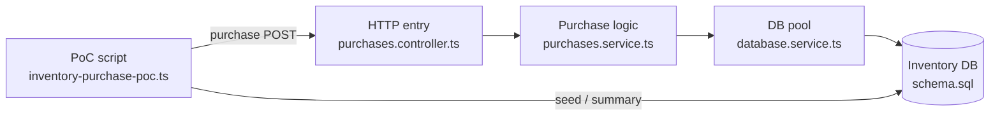

# 在庫購入 PoC 読み解きガイド

## ステータス

初期実装向けの読み解きメモ。

このドキュメントは、在庫購入 PoC のコードを読むための入口です。実行手順は [在庫購入 PoC](./inventory-purchase-poc.md) を正本とします。

## 構成図

現行 PoC は、検証スクリプトが API を叩き、API が PostgreSQL の在庫を条件付き更新する構成です。Valkey は Docker Compose にありますが、現行の購入経路ではまだ使っていません。



Mermaid が表示されない環境では、次の関係として読みます。

```text
PoC script
  inventory-purchase-poc.ts
    | purchase POST
    v
HTTP entry
  purchases.controller.ts
    |
    v
Purchase logic
  purchases.service.ts
    |
    v
DB pool
  database.service.ts
    |
    v
Inventory DB
  schema.sql

PoC script は seed / 集計のために DB も直接読む。
```

## 主要ファイル

| ファイル | 役割 |
|---|---|
| `scripts/poc/inventory-purchase-poc.ts` | PoC を外側から実行する検証ドライバー |
| `src/purchases/purchases.controller.ts` | `POST /events/:eventId/purchases` の HTTP 入口 |
| `src/purchases/purchases.service.ts` | 入力検証、在庫更新、購入履歴作成の本体 |
| `src/database/database.service.ts` | PostgreSQL 接続 pool の管理 |
| `database/schema.sql` | `events`、`ticket_inventory`、`purchases` の DB 定義 |

読む順番は、外側から内側へ進むのが分かりやすいです。

```text
inventory-purchase-poc.ts
  -> purchases.controller.ts
  -> purchases.service.ts
  -> database.service.ts
  -> schema.sql
```

## `inventory-purchase-poc.ts` の役割

`scripts/poc/inventory-purchase-poc.ts` は、購入処理そのものではありません。PoC を外側から動かして、結果を確認するためのスクリプトです。

主な役割:

- PostgreSQL に検証用イベントを作る。
- そのイベントに初期在庫を作る。
- NestJS API に購入リクエストを並列で投げる。
- 最後に PostgreSQL を直接読んで結果を集計する。
- 在庫超過が起きていないか判定する。

## `main()` の中核処理

`main()` はこのスクリプト全体の流れを決める関数です。最初に読むべき中核部分は次です。

```ts
try {
  // NestJS API が起動しているか確認する。
  // 中では GET /health を呼ぶ。
  // await があるので、この確認が終わるまで次の行には進まない。
  await assertApiIsReady();

  // PostgreSQL に検証用の event と ticket_inventory を作る。
  // seedEvent は非同期関数なので、DB の INSERT が終わるまで await で待つ。
  // 完了すると、作成されたイベントの UUID が eventId として返る。
  const eventId = await seedEvent(pool);

  // 今回の PoC 実行を識別するための UUID を作る。
  // randomUUID は同期処理なので await は不要。
  // この runId は、各購入リクエストの requestId に含めて使う。
  const runId = randomUUID();

  // 購入リクエストを複数回送る。
  // purchaseAttempts は合計試行回数。
  // purchaseConcurrency は同時に実行する件数。
  //
  // main から見ると await があるので、
  // runWithConcurrency 全体が完了するまで次の処理には進まない。
  //
  // ただし runWithConcurrency の中では、
  // sendPurchase を purchaseConcurrency 件ずつ並列実行する。
  const results = await runWithConcurrency(
    purchaseAttempts,
    purchaseConcurrency,

    // runWithConcurrency が各 index に対して呼び出す関数。
    // index は 0, 1, 2... のような購入試行番号。
    // sendPurchase は API に POST /events/:eventId/purchases を送る。
    // eventId は購入対象イベント、runId は今回の実行 ID、
    // index は requestId を一意にするために使う。
    (index) => sendPurchase(eventId, runId, index),
  );

  // results には、各購入リクエストの実行結果が入る。
  // この後の処理で confirmed / rejected / error を集計する。
} finally {
  // try の中で成功しても失敗しても必ず実行される。
  // PostgreSQL 接続 pool を閉じて、DB 接続を後片付けする。
  await pool.end();
}
```

コメントを外すと、流れは次のように読めます。

```ts
try {
  await assertApiIsReady();

  const eventId = await seedEvent(pool);
  const runId = randomUUID();

  const results = await runWithConcurrency(
    purchaseAttempts,
    purchaseConcurrency,
    (index) => sendPurchase(eventId, runId, index),
  );

  // ...
} finally {
  await pool.end();
}
```

この範囲で押さえること:

- `assertApiIsReady()` は API 起動確認だけを行うため、戻り値を変数に入れない。
- `seedEvent(pool)` は作成したイベント ID を後で使うため、`eventId` に入れる。
- `randomUUID()` は同期処理なので `await` しない。
- `runWithConcurrency(...)` は、内部で複数の `sendPurchase()` を並列実行する。
- `finally` の `pool.end()` は、成功しても失敗しても DB 接続を閉じるために実行される。

## 用語メモ

| 用語 | この PoC での意味 |
|---|---|
| `event` | チケット販売対象のライブ、試合、公演など |
| `eventId` | 購入対象イベントの UUID |
| `seed` | 検証前に必要なイベントや在庫を DB に入れること |
| `pool` | PostgreSQL 接続を使い回すための接続 pool |
| `attempt` | 成功するかどうかとは別に、購入を 1 回試すこと |
| `runId` | 今回の PoC 実行を識別する UUID |
| `requestId` | 同じ購入リクエストの再送を見分けるための任意 ID |
| `confirmed` | 在庫を確保できた購入 |
| `rejected` | 在庫不足などで確保できなかった購入 |
| `oversold` | 在庫数を超えて購入確定してしまった状態 |

## `async` / `await` の読み方

`async` が付いた関数は `Promise` を返します。DB アクセスや HTTP リクエストのように、結果が返るまで時間差がある処理で使います。

`await` は、非同期処理の完了を待ち、`Promise` の中身を取り出すために使います。

この PoC の `main()` では、次のように読みます。

```text
await assertApiIsReady()
  API の起動確認が終わるまで待つ。

const eventId = await seedEvent(pool)
  DB に検証用イベントと在庫を作り終わるまで待つ。
  完了したら eventId を受け取る。

const runId = randomUUID()
  同期処理なので、その場で UUID が返る。

const results = await runWithConcurrency(...)
  購入リクエスト群の実行がすべて終わるまで待つ。
```

## このガイドの範囲外

このガイドは、現行の在庫購入 PoC を読むための最小メモです。次の内容は別フェーズで扱います。

- Valkey を在庫前段フィルタとして使う実装。
- k6 による負荷テスト。
- SQS FIFO によるイベント単位の流量制御。
- OpenSearch を使う検索 PoC。
