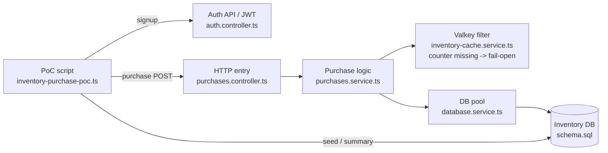

# 在庫購入 PoC 読み解きガイド

## ステータス

現行の在庫購入 PoC を、在庫正確性の経路に絞って読むためのガイド。

このドキュメントは、在庫購入 PoC のコードを読むための入口です。実行手順は [在庫購入 PoC](./inventory-purchase-poc.md) を正本とします。

## 構成図

現行 PoC は、検証スクリプトが signup で access token を取得して購入 API を叩き、API が Valkey 前段フィルタを経て PostgreSQL の在庫を条件付き更新する構成です。検証スクリプトはイベントと在庫を DB へ直接 seed するため Valkey カウンタは初期化されず、この PoC 単体では Valkey が `unknown` を返す fail-open 経路になります。したがって合否判定の中心は PostgreSQL の条件付き更新です。



Mermaid が表示されない環境では、次の関係として読みます。

```text
PoC script
  inventory-purchase-poc.ts
    | purchase POST
    v
HTTP entry
  purchases.controller.ts
    |
    v
Purchase logic
  purchases.service.ts
    |
    +--> Valkey filter
    |      inventory-cache.service.ts
    |      (counter missing -> fail-open)
    |
    v
DB pool
  database.service.ts
    |
    v
Inventory DB
  schema.sql

PoC script は seed / 集計のために DB も直接読む。
```

## 主要ファイル

| ファイル | 役割 |
| --- | --- |
| `scripts/poc/inventory-purchase-poc.ts` | PoC を外側から実行する検証ドライバー |
| `src/auth/auth.controller.ts` / `src/auth/jwt-auth.guard.ts` | signup と購入 API の JWT 認証 |
| `src/purchases/purchases.controller.ts` | `POST /events/:eventId/purchases` の HTTP 入口 |
| `src/purchases/purchases.service.ts` | 入力検証、在庫更新、購入履歴作成の本体 |
| `src/cache/inventory-cache.service.ts` | Valkey 前段フィルタ。カウンタ不在・障害時は DB へ fail-open |
| `src/database/database.service.ts` | PostgreSQL 接続 pool の管理 |
| `database/schema.sql` | `events`、`ticket_inventory`、`purchases` の DB 定義 |

読む順番は、外側から内側へ進むのが分かりやすいです。

```text
inventory-purchase-poc.ts
  -> auth.controller.ts / jwt-auth.guard.ts
  -> purchases.controller.ts
  -> purchases.service.ts
  -> inventory-cache.service.ts
  -> database.service.ts
  -> schema.sql
```

## `inventory-purchase-poc.ts` の役割

`scripts/poc/inventory-purchase-poc.ts` は、購入処理そのものではありません。PoC を外側から動かして、結果を確認するためのスクリプトです。

在庫超過を防ぐ本体は、`src/purchases/purchases.service.ts` の `remaining_quantity >= quantity` を含む conditional UPDATE です。このスクリプトは、その購入経路を HTTP 経由で並列に叩き、DB の最終状態を検証します。

主な役割:

- PostgreSQL に検証用イベントを作る。
- そのイベントに初期在庫を作る。
- NestJS API に購入リクエストを並列で投げる。
- 最後に PostgreSQL を直接読んで結果を集計する。
- 在庫超過が起きていないか判定する。

## `main()` の中核処理

`main()` はこのスクリプト全体の流れを決める関数です。まずは次の範囲を見ると、PoC の実行順がつかめます。

```ts
try {
  await assertApiIsReady();

  const eventId = await seedEvent(pool);
  const runId = randomUUID();

  const results = await runWithConcurrency(
    purchaseAttempts,
    purchaseConcurrency,
    (index) => sendPurchase(eventId, runId, index),
  );

  // ...
} finally {
  await pool.end();
}
```

この範囲で押さえること:

- `assertApiIsReady()` で API の `/health` を確認してから進む。
- `seedEvent(pool)` で検証用イベントと在庫を作り、以後の購入対象になる `eventId` を受け取る。
- `runId` は今回の実行を識別する UUID で、各購入リクエストの `requestId` に使う。
- `runWithConcurrency(...)` は購入リクエストを `purchaseConcurrency` 件ずつ並列実行する。
- `finally` で `pool.end()` を呼び、成功・失敗に関係なく DB 接続を閉じる。

## このガイドの範囲外

このガイドは、現行の在庫購入 PoC を読むための最小メモです。次の内容は別フェーズで扱います。

- Valkey を在庫前段フィルタとして使う実装。
- k6 による負荷テスト。
- SQS FIFO によるイベント単位の流量制御。
- OpenSearch を使う検索 PoC。
